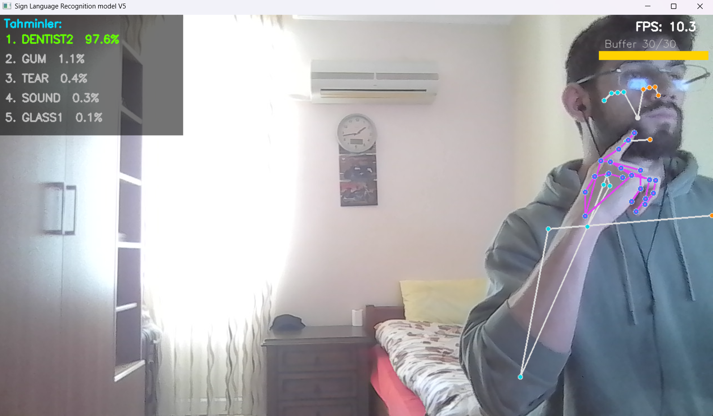
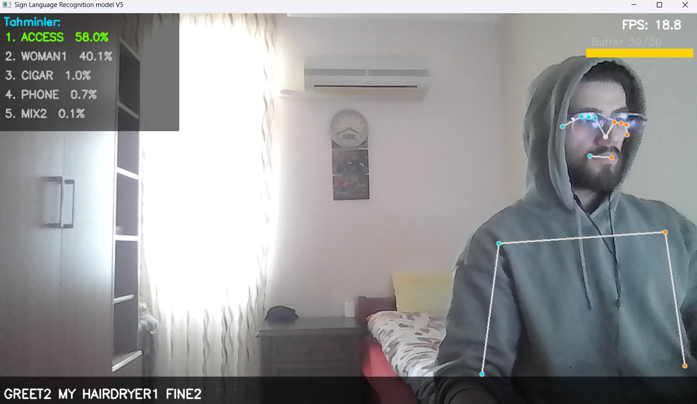
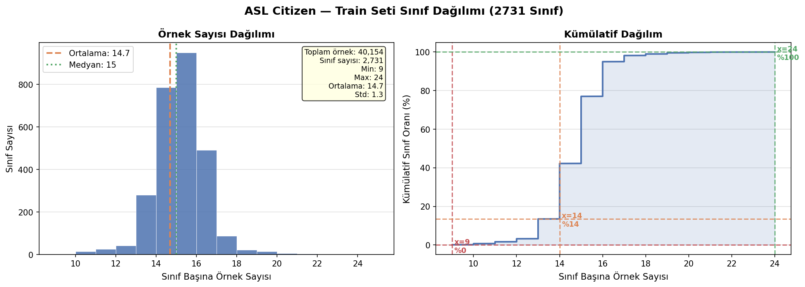
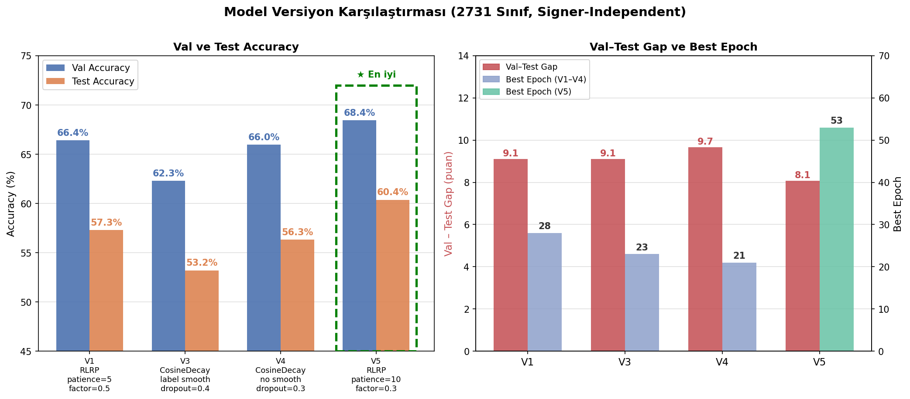
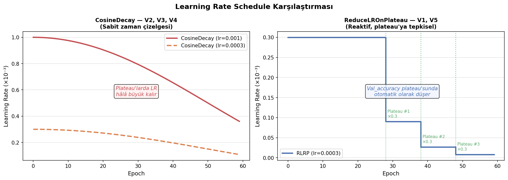

# ASL Sign Language Recognition

**Microsoft ASL Citizen veri seti üzerinde eğitilmiş CNN + BiLSTM + Multi-Head Attention mimarisi kullanılarak webcam üzerinden 2731 farklı ASL işaretini anlık olarak tanıyıp cümle oluşturabilen gerçek zamanlı Amerikan İşaret Dili (ASL) tanıma sistemi geliştirildi.**

<p align="center">
  
  
</p>
<p align="center">
  <em>Sol: Yüksek güven tahmini (%97.6) &nbsp;&nbsp; Sağ: Cümle oluşturma</em>
</p>

---

### *Projenin gelişim süreci, mimari kararlar, deney sonuçlarının detaylı analizi ve teknik kısımlar için: [REPORT.md](REPORT.md)*

---

## İçindekiler

- [Özellikler](#özellikler)
- [Gereksinimler](#gereksinimler)
- [Proje Yapısı](#proje-yapısı)
- [Kurulum ve Kullanım](#kurulum-ve-kullanım)
- [Pipeline Özeti](#pipeline-özeti)
- [Dosya Açıklamaları](#dosya-açıklamaları)
- [Model Mimarisi](#model-mimarisi)
- [Model Versiyonları](#model-versiyonları)
- [Dataset Lisansı](#dataset-lisansı)
- [Önemli Notlar](#önemli-notlar)
- [Değerlendirme](#değerlendirme)

---

## Özellikler

- **2731 ASL işareti** — Microsoft ASL Citizen veri seti üzerinde eğitilmiş
- **Signer-independent** — eğitimde görülmemiş kişiler üzerinde test edilmiş
- **Gerçek zamanlı çıkarım** — 15–20 FPS, webcam üzerinden
- **Vücut-göreceli normalizasyon** — kamera uzaklığı ve pozisyondan bağımsız
- **6x veri artırımı** — az örnekli sınıflarda overfitting hafifletme
- **Kararlılık tabanlı cümle oluşturma** — geçici hataları filtreleme ve kelime tutma
- **Top-5 tahmin görüntüleme** — güven yüzdeleri ile tahminler

---

## Gereksinimler

```
Python >= 3.8, <= 3.10
tensorflow >= 2.10
pip install mediapipe==0.10.9 --no-deps  # GPU ortamıyla uyumlu versiyon
opencv-python
scikit-learn
joblib
numpy
pandas
tqdm
```

Kurulum:

```bash
pip install tensorflow mediapipe opencv-python scikit-learn joblib numpy pandas tqdm
```

GPU için (opsiyonel ama train için önerilir):

```bash
pip install tensorflow[and-cuda]
```

---

## Proje Yapısı

```
sign_language/
│
├── ASL_Citizen/
│   ├── splits/
│   │   ├── train.csv          # 40,154 kayıt: Participant ID, Video file, Gloss, ASL-LEX Code
│   │   ├── val.csv            # 10,304 kayıt
│   │   └── test.csv           # 32,941 kayıt
│   ├── videos/                # {id}-{GLOSS}.mp4 — 83,399 video (flat klasör)
│   └── use.txt                # Microsoft Research lisans koşulları
│
├── features/                  # landmarks_extract.py çıktısı — .gitignore'da hariç tutulmuştur; landmarks_extract.py ve load_dataset.py çalıştırılarak yeniden üretilebilir
│   ├── train/
│   │   └── {class_idx}/       # 0 – 2730
│   │       └── *.npy          # Her video için (30, 258) array
│   ├── val/
│   │   └── {class_idx}/*.npy
│   ├── test/
│   │   └── {class_idx}/*.npy
│   ├── cache_train_aug.npz    # ~750 MB — augmented train cache
│   ├── cache_val.npz          # ~30 MB
│   └── cache_test.npz         # ~100 MB
│
├── models/
│   ├── cnn_bilstm_attention_model_v5.h5       # Aktif model (~15 MB)
│   ├── standardscaler.save                     # V5 StandardScaler
│   ├── cnn_bilstm_attention_model_v4.h5
│   ├── cnn_bilstm_attention_model_v3.h5
│   ├── cnn_bilstm_attention_model_v1.h5
│   ├── cnn_bilstm_attention_model_top100.h5   # Top-100 referans
│   ├── bidirectional_lstm_model_top100.h5
│   ├── bidirectional_lstm_cnn_model_top100.h5
│   ├── base_lstm_model_top100.h5
│   └── standardscaler_top100.save
│
├── experiments/
│   └── letter_recognition/    # Proje öncesi alfabe tanıma prototipi (deney)
│       ├── collect_data.py    # Webcam ile landmark veri toplama
│       ├── train_model.py     # Dense NN eğitimi (26 harf)
│       ├── predict_live.py    # Gerçek zamanlı harf tahmini
│       ├── asl_model.h5
│       ├── label_encoder.pkl
│       └── dataset/
│           └── asl_landmarks.csv
│
├── archive/                   # MS-ASL dönemi (kullanılmıyor)
│   ├── ms_asl/                # MS-ASL JSON dosyaları (clean + filtered)
│   ├── msasl-video-downloader/ # yt-dlp tabanlı video indirici
│   ├── class_distribution_analysis.py
│   ├── clean_msasl_json.py
│   ├── threshold_filter_remap.py
│   ├── base_lstm_model.h5     # MS-ASL döneminden LSTM
│   ├── svm_model.save         # MS-ASL döneminden SVM (~6.8 MB)
│   ├── standardscaler.save
│   └── svm_scaler.save
│
├── docs/                      # Görseller
│   ├── dentist97.png
│   ├── greet_my_hairdryer_fine.png
│   ├── sshh75.png
│   ├── version_comparison.png
│   ├── class_distribution.png
│   └── lr_schedule_comparison.png
│
├── landmarks_extract.py       # Video → .npy özellik çıkarımı
├── load_dataset.py            # Veri yükleme, augmentasyon, cache
├── base_models.py             # Model mimarileri (4 model)
├── train.py                   # Eğitim betiği
└── inference.py               # Gerçek zamanlı webcam çıkarımı
```

---

## Kurulum ve Kullanım

> **Not:** `landmarks_extract.py`, `load_dataset.py` ve `inference.py` dosyalarının en üstünde proje dizinine ait sabit path'ler bulunmaktadır. Çalıştırmadan önce bu path'leri kendi dizininize göre güncellemeyi unutmayın.

### Adım 1: ASL Citizen Veri Setinin İndirilmesi

Veri seti [Microsoft'un sitesinden](https://download.microsoft.com/download/b/8/8/b88c0bae-e6c1-43e1-8726-98cf5af36ca4/ASL_Citizen.zip) indirilebilir. İndirilen videolar `ASL_Citizen/videos/` klasörüne, CSV dosyaları `ASL_Citizen/splits/` klasörüne konulmalıdır.

### Adım 2: Landmark Çıkarımı

```bash
python landmarks_extract.py
```

Her video için MediaPipe Holistic çalıştırılır ve normalize edilmiş landmark koordinatları `features/{split}/{class_idx}/{video_id}.npy` olarak kaydedilir. shape: `(30, 258)`.

> **Süre:** 83,399 video için ~132 saat (donanım bileşenlerinize bağlı olarak değişebilir). Mevcut `.npy` dosyaları varsa otomatik atlanır; işlem kaldığı yerden devam eder.

> **Seçici çalıştırma:** `process_split()` içinde `selected_glosses` parametresi ile yalnızca belirli sınıflar işlenebilir (örn. hızlı prototip ve deney için top-100).

### Adım 3: Eğitim

```bash
python train.py
```

İlk çalıştırmada augmented cache oluşturulur (`features/cache_train_aug.npz` — ~750 MB, ~+20 dakika). Sonraki çalıştırmalarda cache'den saniyeler içinde yüklenir.

Çıktı dosyaları:
- `models/cnn_bilstm_attention_model_v5.h5`
- `models/standardscaler.save`

> **RAM:** Peak ~8.5 GB (scale sonrası geçici array'ler temizlenir. yoksa 32 gb ram için bellek yetersizliğinden OOM hatasıne sebep oluyor).
> **GPU:** Varsa otomatik kullanılır (önerilir); yoksa CPU üzerinde çalışır (CPU ile çok daha yavaş).

### Adım 4: Gerçek Zamanlı Çıkarım

```bash
python inference.py
```

Webcam açılır. Kameraya yapılan işaretler algılanır ve ekranın sol üstünde top-5 tahmin, alt panelde oluşturulan cümle görünür.

**Klavye kontrolleri:**

| Tuş | Eylem |
|-----|-------|
| `Q` | Uygulamayı kapat |
| `Space` | Cümleyi ve tahmin geçmişini temizle |
| `Backspace` | Cümledeki son kelimeyi sil |

---

## Pipeline Özeti

```
Video dosyaları (.mp4)
        │
        ▼
landmarks_extract.py
 ├─ MediaPipe Holistic (pose + 2 el)
 ├─ Vücut-göreceli normalizasyon
 │   ├─ Referans: omuz orta noktası (shoulder-mid)
 │   ├─ Referans: kalça orta noktası (hip-mid)
 │   └─ Ölçek: omuz-kalça 2D mesafesi (torso scale)
 ├─ Temporal normalize: lineer interpolasyon → 30 frame
 └─ .npy kayıt: (30, 258) per video
        │
        ▼
load_dataset.py
 ├─ Cache kontrolü (cache_*.npz mevcutsa direkt yükler)
 ├─ Augmentasyon (sadece train, 6x):
 │   ├─ Orijinal (1x)
 │   ├─ Landmark aug: gürültü + temporal shift + hız (4x)
 │   └─ Aynalama aug: sol↔sağ flip (1x)
 └─ Cache kayıt (cache_*.npz)
        │
        ▼
train.py
 ├─ StandardScaler fit (train üzerinde)
 ├─ Sıfır frame koruması (Masking bozulmasının önlenmesi)
 ├─ Class weight hesaplama (balanced)
 ├─ CNN + BiLSTM + Attention modeli
 ├─ ReduceLROnPlateau + EarlyStopping
 └─ Model + scaler kayıt
        │
        ▼
inference.py
 ├─ MediaPipe Holistic (canlı)
 ├─ deque(maxlen=30) sliding window
 ├─ StandardScaler.transform + zero-mask
 ├─ Model predict (n = her 3 frame'de bir)
 ├─ Top-5 tahmin
 └─ Kararlılık tabanlı cümle oluşturma
```

---

## Dosya Açıklamaları

### `landmarks_extract.py`

Video dosyalarından MediaPipe Holistic ile iskelet landmarkları çıkarılır, normalize edilir ve `.npy` olarak kaydedilir.

**Özellik vektörü (258 boyut = 1 frame):**

| Bölge | Landmark | Boyut    | Açıklama |
|-------|----------|----------|----------|
| Pose | 33 | x4 = 132 | x, y, z, visibility |
| Sol el | 21 | x3 = 63  | x, y, z |
| Sağ el | 21 | x3 = 63  | x, y, z |

**Normalizasyon neden gerekli?**

Ham MediaPipe koordinatları kameraya ve kişinin pozisyonuna göre olduğundan eğer video 1'deki kişi kameraya yakın, video 2'deki kişi kameraya uzaksa; aynı işaret farklı koordinat değerleri üretir. Bunu çözmek için:

```
# landmark 11 = sol omuz  # landmark 12 = sağ omuz
# landmark 23 = sol kalça  # landmark 24 = sağ kalça

shoulder_mid  = (left_shoulder  + right_shoulder) / 2
hip_mid       = (left_hip       + right_hip)      / 2
torso_scale   = ||shoulder_mid[:2] − hip_mid[:2]||   (2D öklid)

pose[i, :3]   = (pose[i, :3]  − shoulder_mid) / torso_scale
hand landmarks: önce bilek-göreceli, sonra bilek vücut-göreceli
```

**Label mapping:** Tüm split'lerdeki gloss'lar toplanır, alfabetik sıraya göre 0 tabanlı integer index oluşturulur (2731 class). Bu mapping her çalıştırmada deterministik olması için `sorted()` ile garanti altına alınmıştır.

**`temporal_resize()`:** Her video farklı kare sayısına sahip olabilir. Lineer interpolasyon ile tüm videolar 30 kareye (target frames) normalize edilir. Bu sayede derin öğrenme modeline *timestep, feature_dim* değişkenleri sabit olarak verilebilir.

---

### `load_dataset.py`

<p align="center">
  
</p>

`.npy` dosyalarını yükler, augmentasyon uygular ve sonuçları cache'e kaydeder.

**Cache sistemi:**

```
İlk çalıştırma:  .npy dosyaları okunur → augmentasyon → cache_*.npz kaydedilir
Sonraki çalıştırmalar: cache_*.npz direkt yüklenir (dakikalar → saniyeler)
```

> Cache dosyaları augmentasyonu **deterministik** yapar — her eğitim aynı artırılmış veriyle çalışır. Augmentasyon mantığı değiştirilirse `features/cache_*.npz` dosyaları silinmelidir. Zaman ve augmentation maliyetini azaltmak ve deneylerin daha hızlı gerçekleştirilebilmesi için cache tercih edildi. 

**Augmentasyon detayları (6x çoğaltma, sadece train):**

*Landmark Augmentasyon (4c kopya, her biri farklı random seed):*
1. Gaussian gürültü: `σ = 0.005`, sıfır frame'ler korunur
2. Temporal shift: `[−1, +1]` kare arası kaydırılır ve padding ile kenar tekrarı sağlanır
3. Hız değişimi (50% olasılık): `×0.9–1.1`, lineer interpolasyon → 30 kare resample

*Aynalama Augmentasyonu (1x kopya):*
- Pose için x koordinatları negatifler `-x`
- 16 sol–sağ landmark çifti swap edilir (omuz, dirsek, bilek, kalça, diz, ayak vb.)
- Sol ve sağ el feature blokları yer değiştirir
- El için x koordinatları negatifler `-x`
- - sol → sağ
- - sağ → sol

---

### `base_models.py`

Dört model mimarisi içerir. Tüm modeller `sparse_categorical_crossentropy` ile derlenir (label'lar integer formatında).

| Fonksiyon | Parametre sayısı (2731 class) | Notlar |
|-----------|-------------------------------|--------|
| `base_lstm_model` | ~4.5M | LSTM×2 + Dense |
| `bidirectional_lstm_model` | ~11M | BiLSTM×2 + Dense |
| `bidirectional_lstm_cnn_model` | ~1.9M | Conv1D×2 + BiLSTM + Dense |
| `cnn_bilstm_attention_model` | ~15M | **Aktif model** |

> `bidirectional_lstm_cnn_model`'de Masking katmanı kaldırılmasının sebebi; Conv1D katmanı, mask propagation'ı desteklemez.

---

### `train.py`

**StandardScaler ve sıfır frame koruması:**

```python
# Scale öncesi sıfır satırlar işaretlenir
zero_mask = (X_2d == 0.0).all(axis=1)

X_scaled = scaler.fit_transform(X_2d)

# Scale sonrası bozulan sıfırlar geri yüklenir. Bu sayede masking layer uyumluluğu sağlanır ve orjinal sıfırlar bozulmaz
X_scaled[zero_mask] = 0.0
```

StandardScaler sıfır değerleri `(0 − mean) / std` ile dönüştürür ve Masking layer bunları artık tanıyamaz. Bu adım olmadan sıfır padding frame'leri de eğitime dahil edilir.

**Eğitim ayarları:**

| Parametre | Değer |
|-----------|-------|
| Optimizer | Adam |
| Learning rate (başlangıç) | 0.0003 |
| Loss | sparse_categorical_crossentropy |
| Batch size | 64 |
| Max epoch | 100 |
| Class weight | balanced |

**Callbacks:**

| Callback | Ayar | Açıklama                                                        |
|----------|------|-----------------------------------------------------------------|
| ReduceLROnPlateau | patience=10, factor=0.3, min_lr=1e-6 | val_accuracy plateau'sunda LR'yi ×0.3'e indirir                 |
| EarlyStopping | patience=15, restore_best_weights=True | 15 epoch iyileşme olmazsa durur, en iyi ağırlıkları geri yükler |

**Bellek yönetimi:** Scale işlemi sonrası geçici 2D array'ler silinerek ~8.5 GB RAM serbest bırakılır. Bu sayede OOM hatasının önüne geçilir. (donanıma göre değişkenlik gösterebilir)

```python
del X_train_2d, X_train_2d_scaled
del X_val_2d,   X_val_2d_scaled
del X_test_2d,  X_test_2d_scaled
```

---

### `inference.py`

Gerçek zamanlı webcam tabanlı işaret tanıma.

**Sliding window:** `deque(maxlen=30)` — her yeni kare eklenir, 31. kare otomatik düşer. Buffer dolduğunda (30 kare) her 3 karede bir tahmin yapılır. (n = 3)

**Tahmin sıklığı neden 3?** Her karede `model.predict()` çağrısı FPS'i ~5'e düşürür. Her 3 karede bir çağrı FPS'i ~15–20'de tutar ve tahmin kalitesini koruyarak daha akıcı fps değeri sunar.

**Cümle oluşturma mantığı:** (bu ayarlar daha da optimize edilebilir..!)

```
Son STABILITY_COUNT (=5) tahmin aynı kelime
  VE tüm bu tahminler CONFIDENCE_THR (≥ 0.60) üstü
  VE (farklı kelime VEYA LOCK_DURATION (1.5 sn) geçmiş)
→ Cümleye ekle
```

**UI bileşenleri:**

| Konum | İçerik |
|-------|--------|
| Sol üst | Top-5 tahmin (kelime + güven %) |
| Sağ üst | FPS sayacı + buffer doluluk çubuğu |
| Alt panel | Oluşturulan cümle (Space/Backspace kontrolü) |

---

## Model Mimarisi

```
Input (batch, 30, 258)
│
├─ Conv1D(64 filtre, kernel=3, padding=same, L2=0.001)
│   BatchNormalization → ReLU
│
├─ Conv1D(64 filtre, kernel=3, padding=same, L2=0.001)
│   BatchNormalization → ReLU
│               ↓ (batch, 30, 64)
│
├─ Bidirectional(LSTM(128, return_sequences=True, recurrent_dropout=0.0))
│               ↓ (batch, 30, 256)   [128 ileri + 128 geri]
│
├─ Dropout(0.3)
│
├─ MultiHeadAttention(num_heads=4, key_dim=64)  — self-attention
│   Her frame diğer 29 frame'e bakarak ağırlık hesaplar!
│
├─ LayerNormalization(x + attention)  — residual connection
│               ↓ (batch, 30, 256)
│   BiLSTM çıktsı + attention çıktısı toplanarak korunur (x + attention).
│   Bu sayede attention'ın yanlış öğrendiği ya da öğrenemediği bilgiler bypass edilebilir. 
│
├─ tf.reduce_mean(axis=1)  →  (batch, 256)
│
├─ Dense(256, relu, L2=0.001)
│   Dropout(0.5)
│
└─ Dense(2731, softmax)
```

**Mimari tasarım kararları:**

- **Conv1D bloğu:** Frame'lerdeki kısa süreli hareketleri yakalayıp zenginleştirerek BiLSTM modeline daha anlamlı ve sıkıştırılmış hareket temsili verir (parmak hareketleri, bilek rotasyonları).
- - Conv1D bloğu ile frame sayısı değil frame içeriği zenginleştirildi.
- **BiLSTM:** İki yönlü bağlamı yakalar — bir işaret genellikle geçmiş ve gelecek karelerle anlam kazanır.
- **Self-Attention:** Hangi frame'lerin ne kadar önemli olduğunu dinamik olarak öğrenir; işaretin zirve noktasına daha fazla ağırlık verir.
- **Residual Connection + LayerNorm:** Derin ağlarda gradyan akışını stabilize eder.
- **reduce_mean:** Attention çıktısını tek vektöre indirger; parametresiz ve kararlı hale getirir.

---

## Model Versiyonları

| Ver | LR Schedule | LR | RLRP patience | factor | Dropout | Label Smooth | Val Acc | Test Acc | Best Epoch |
|-----|-------------|-----|---------------|--------|---------|--------------|---------|----------|------------|
| V1 | RLRP | 3e-4 | 5 | 0.5 | 0.3 | Hayır | 66.4% | 57.3% | 28 |
| V2 | CosineDecay | 1e-3 | — | — | 0.4 | Evet | ~60.0% | 49.83% | ~22 |
| V3 | CosineDecay | 1e-3 | — | — | 0.4 | Evet | 62.3% | 53.2% | 23 |
| V4 | CosineDecay | 3e-4 | — | — | 0.3 | Hayır | 65.97% | 56.31% | 21 |
| **V5** | **RLRP** | **3e-4** | **10** | **0.3** | **0.3** | **Hayır** | **68.44%** | **60.37%** | **53** |

RLRP: ReduceLROnPlateau

<p align="center">
  
</p>

<p align="center">
  
</p>

**En iyi model:** `models/cnn_bilstm_attention_model_v5.h5`
- **V5'in kritik farkı:** `patience=5→10` ve `factor=0.5→0.3` — model epoch 28'de durmak yerine epoch 53'e kadar öğrenebildi. Bu sayede daha iyi genelleme sağlandı.

---

## Dataset Lisansı

ASL Citizen veri seti **Microsoft Research Lisansı** altındadır (`ASL_Citizen/use.txt`):

- Yalnızca **araştırma amaçlı**, ticari olmayan kullanım
- Veri dağıtımı **yasaktır** — videolar ve CSV dosyaları GitHub'a yüklenemez
- Kaynak: [Microsoft ASL Citizen](https://www.microsoft.com/en-us/download/details.aspx?id=105253)

**Bu proje yalnızca kaynak kodunu paylaşır. Veri seti ayrıca indirilmelidir.**

---

## Önemli Notlar

**Cache sistemi:** `features/cache_*.npz` dosyaları augmentasyonu deterministik yapar. `load_dataset.py` içinde augmentasyon mantığı değiştirilirse bu dosyalar silinmelidir, aksi halde eski augmentation kullanılmaya devam eder.

**Val–Test gap (~9 puan):** Signer-independent split'in yapısal sonucudur. Tüm versiyonlarda sabit kaldı — hiperparametre ayarı ile kapatılamaz. Temel nedeni: sınıf başına ~15 örnek ve ~3 imzacı, modelin işareti değil imzacı stilini öğrenmesine yol açar.

---

## Değerlendirme

Bu proje kapsamında 2731 sınıf, signer-independent, sınıf başına ~15 örnek koşulunda **%60.37 test doğruluğu** elde edildi. Random baseline ile karşılaştırıldığında ~1631× iyileştirme sağlandı. Val–test gap (~8 puan) yapısal bir veri sorununu yansıtmakta olup mevcut sonuçlar literatürdeki benzer zorluktaki çalışmalarla rekabetçi olduğu gözlemlendi ve gerçek zamanlı demo için yeterli olduğu varsayıldı.

Bu README'yi sonuna kadar okuduğunuz için teşekkür ederim. Proje hakkında görüş ve önerilerinizi iletmekten çekinmeyin.

**İletişim:**

[](https://github.com/BoraErenErdem)
[](https://www.linkedin.com/in/bora-eren-erdem-9b132b339/)