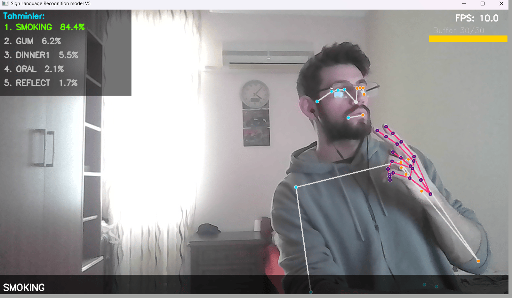

# Teknik Rapor: Gerçek Zamanlı ASL İşaret Dili Tanıma Sistemi

**Tarih:** Mart 2026

**Nihai Veri Seti:** ASL Citizen (Microsoft Research, 2023)

**Proje:** 2731 sınıflı, signer-independent, gerçek zamanlı işaret dili tanıma

---

## İçindekiler

1. [Giriş ve Motivasyon](#1-giriş-ve-motivasyon)
2. [Proje Gelişim Süreci](#2-proje-gelişim-süreci)
3. [Faz 1 — Alfabe Tanıma Prototipi](#3-faz-1--alfabe-tanıma-prototipi-experimentsletter_recognition)
4. [Faz 2 — MS-ASL Girişimi](#4-faz-2--ms-asl-girişimi-archive)
5. [Faz 3 — ASL Citizen ile Tam Sistem](#5-faz-3--asl-citizen-ile-tam-sistem)
6. [Özellik Çıkarım Pipeline'ı](#6-özellik-çıkarım-pipelineı)
7. [Veri Artırımı](#7-veri-artırımı)
8. [Model Mimarileri](#8-model-mimarileri)
9. [Top-100 Prototipleme Deneyleri](#9-top-100-prototipleme-deneyleri)
10. [Tam Dataset Eğitimi Verisyonları — V1'den V5'e](#10-tam-dataset-eğitimi--v1den-v5e)
11. [Gerçek Zamanlı Çıkarım](#11-gerçek-zamanlı-çıkarım)
12. [Sonuçlar ve Analiz](#12-sonuçlar-ve-analiz)
13. [Kısıtlamalar ve Gelecek Çalışmaları](#13-kısıtlamalar-ve-gelecek-çalışmalar)
14. [Sonuç](#14-sonuç)

---

## 1. Giriş ve Motivasyon

İşaret dili tanıma, işitme engelli bireylerin iletişimini kolaylaştırmayı hedefleyen ve bilgisayarlı görü, makine öğrenmesi, derin öğrenme ve doğal dil işlemenin kesiştiği bir alandır. Mevcut sistemlerin büyük çoğunluğu sınırlı kelime dağarcığıyla ya da kontrollü koşullarda çalışmaktadır.

Bu projede dört temel zorluk eş zamanlı ele alınmıştır:

- **Ölçek:** 2731 farklı ASL işareti — pratik bir kelime dağarcığına ulaşmak için gerekli minimum
- **Veri kıtlığı:** Sınıf başına ortalama yalnızca 14.7 eğitim örneği
- **Genelleme:** Signer-independent ayar — eğitimde görülmemiş kişilerde çalışma
- **Gerçek zamanlılık:** Standart webcam üzerinden düşük gecikme

Yaklaşım olarak video tabanlı CNN yerine daha hafif, hızlı ve pozisyondan bağımsız olan **iskelet landmark** temelli bir pipeline tercih edilmiştir.

---

## 2. Proje Gelişim Süreci

Proje, giderek büyüyen üç aşamada gelişti. Her aşama bir öncekinin kısıtlamalarını ya da eksikliklerini gidermek için kuruldu. Her aşama bir öncekinden oldukça fazla deney ve gözlem içermektedir.

```
├─ Faz 1: Alfabe prototipi (experiments/letter_recognition)
│   → En başta YOLO + CNN yöntemi denendi. Ancak kararsızlık ve genelleme sorunundan dolayı Mediapipe + NN yöntemine geçildi.
│   Tek el, statik pozlar, 26 harf, Dense NN
│   → Çalışıyor ama yalnızca statik. Dinamik işaretler desteklenmiyor.
│
├─ Faz 2: MS-ASL girişimi (archive)
│   YouTube'dan video indirme (yt-dlp), SVM + LSTM denemeleri
│   → Videoların %30-40'ı YouTube'dan kaldırılmış veya private.
│   → Ayrıca threshold filter ile geriye 217 class kalıyor ve her class için örnek sayısı 15 ile 50 arasında değişiyor.
│
└─ Faz 3: ASL Citizen (ana sistem)
    Microsoft'un önceden indirilmiş veri seti, 83,399 video
    → Full pipeline: extraction → augmentation → CNN+BiLSTM+Attention
    → Gerçek zamanlı inference + cümle oluşturma
│
└─ Top-100 prototip → V1 → V2 → V3 → V4 → V5 (en iyi model)
```

---

## 3. Faz 1 — Alfabe Tanıma Prototipi (`experiments/letter_recognition/`)

### 3.1 Motivasyon ve Kapsam
En başta YOLO + CNN yöntemi denendi. Ancak kararsızlık ve genelleme sorunundan dolayı Mediapipe + NN yöntemine geçildi.

İlk adım olarak ASL el alfabesi (A–Z, 26 harf) için basit bir gerçek zamanlı tanıma sistemi kuruldu. Amaç, MediaPipe'in nasıl çalıştığını öğrenmek ve uçtan uca bir pipeline oluşturmaktı.

### 3.2 Veri Toplama (`collect_data.py`)

Özel veri toplama betiği yazıldı. Webcam'den MediaPipe Hands ile tek el landmarkları (21 landmark × 3 koordinat = 63 özellik) alındı ve her kare bir satır olarak `dataset/asl_landmarks.csv`'ye yazıldı.

```
Kullanıcı: harf etiketi girilir → Q ile durdurulur → CSV'ye eklenir
```
asl_alphabet.csv veri setimin dağılımı ⇒
- shape → (24352, 64)
- R ~ 1145
- X ~ 1092   
- U ~ 1089   
- W ~ 1077   
- D ~ 1001   
- A ~ 1000   
- M ~ 1000   
- Q ~ 1000   
- P ~  1000   
- O ~ 1000   
- N ~ 1000   
- L ~ 1000   
- K ~ 1000   
- I ~ 1000   
- H ~ 1000   
- G ~ 1000   
- F ~ 1000   
- E ~ 1000   
- B ~ 999   
- S ~ 999   
- C ~ 999  
- Y ~ 997   
- V ~ 990   
- T ~ 964

### 3.3 Model ve Eğitim (`train_model.py`)

**Model:** Saf Dense NN
```
Input (63,) → Dense(256, relu) → Dropout(0.4)
           → Dense(512, relu) → Dropout(0.4)
           → Dense(26, softmax)
```
Etiket: one-hot (`to_categorical`), loss: `categorical_crossentropy`

- Toplanan MediaPipe landmark verileri üzerinde eğitilen MLP modeli %96 doğruluk elde etmiştir.
- Veri toplama sırasında j ve z harfleri hareketli şekillerde gösterildiği için bu harfler baz alınmadı.

### 3.4 Gerçek Zamanlı Tahmin (`predict_live.py`)

Her kare için landmark çıkarma → model tahmini → ekranda harf gösterimi.

### 3.5 Faz 1'in Kısıtlamaları ve Öğrenilen Dersler

| Kısıtlama                                  | Sonraki fazda çözüm                        |
|--------------------------------------------|--------------------------------------------|
| Yalnızca statik pozlar                     | Zaman serisi modelleri (LSTM)              |
| Tek el                                     | Pose + her iki el (MediaPipe Holistic)     |
| 26 sınıf                                   | 2731 sınıf                                 |
| -                                          | Vücut-relative normalizasyon (torso scale) |
| one-hot + categorical CE → büyük vektörler | sparse CE → RAM tasarrufu                  |

- Mediapipe + NN denemesinde mediapipe ile her harf için veri seti oluşturuldu. Bu veri seti MLP sinir ağı ile eğitildi ve çeşitli iyileştirmeler yapıldı. Sonuç olarak j ve z harfleri haricinde bütün harfleri çeşitli ortam, açı ve ışık değişkenlerinde bile %96'lık başarıyla tespit edildi. Bu proje için güzel bir görü ve değerlendirme sağladı. Ancak LSTM veya Transformer modeli kullanmadan işaret dilini anlık çevirme sistemi yapılamayacağı anlaşıldı ve o yüzden bu deneylerden elde edilen bilgi ve sonuçlar ile proje yeniden şekillendirildi.

---

## 4. Faz 2 — MS-ASL Girişimi (`archive/`)

### 4.1 Neden MS-ASL?

MS-ASL (Microsoft American Sign Language Dataset), 1000 kelime sınıfı ve YouTube URL'leri içeren büyük ölçekli bir veri setidir. Nispeten kolay erişilebilir olması nedeniyle tercih edildi.

### 4.2 Video İndirici (`archive/msasl-video-downloader/`)

MS-ASL videoları YouTube bağlantıları üzerinden sağlanır; önceden indirilmiş değildir. Bu nedenle `yt-dlp` tabanlı bir video indirici geliştirildi:

- **`dataset_manager.py`:** Train/val/test split'leri için toplu indirme sağlıyor, `moviepy` ile JSON'dan alınan `start_time`–`end_time` aralığına göre video kırpma
- - dataset_manager.py dosyası çok fazla sorun çıkardığı için yt-dlp aracı entegre edildi.
- **Hata yönetimi:** Her video için 3 retry, private/unavailable videoları skip etme, YouTube rate limiting için her 50 videoda 30 saniye bekleme
- **Dataset boyutu seçimi:** MS-ASL100, 200, 500, 1000 veya her split için tüm veriler
- **`gloss_lookup.py`:** 0–999 arası sınıf ID'sini kelimeye çeviren araç

### 4.3 MS-ASL Ön İşleme Betikleri

**`clean_msasl_json.py`:** İndirilen videoları JSON kayıtlarıyla eşleştirir; indirilememiş ya da bulunamayan videoları JSON'dan çıkarır.
- MSASL train clean.json → clean: 11883  missing: 4171
- MSASL val clean.json → clean: 2510  missing: 2777
- MSASL test clean.json → clean: 2422  missing: 1750

**`class_distribution_analysis.py`:** MS-ASL train setinin sınıf dağılımını analiz eder ve histogram çıkarır. Analiz sonucu: bazı sınıflarda 50+ örnek varken bazılarında yalnızca 2–3 örnek mevcut olduğu gözlemlendi.
<p align="center">
  
</p>
<p align="center">
  <em>Threshold >= 15 eşik değeri filtresi sonrası sınıf dağılımı</em>
</p>

- toplam 999 class ve 15654 video örneği ile long tail problemi olduğu belirlendi.

**`threshold_filter_remap.py`:** Train setinde 15'ten az örneği olan sınıfları threshold >= 15 eşiği ile filtreler, kalan sınıfları 0'dan başlayarak yeniden numaralandırır. Orijinal MS-ASL label'ları ardışık olmadığından bu remapping gerekli.
- threshold seviyesini 15 belirlenmesinin sebebi model hızı ve doğruluğu en optimal olarak 15 olunca elde edildi. Bu yüzden threshold seviyesini 15 olarak belirlendi.
- threshold >= 15 ile total class → 284
- train → 6020
- val → 1156
- test → 912
- train + val + test için toplamda 8088 videonun landmarkı başarıyla çıkarıldı.

### 4.4 MS-ASL Dönemi Model Denemeleri

Bu dönemde hem klasik makine öğrenmesi hem de derin öğrenme denemeleri yapıldı. Ancak hem projenin bu aşamasında landmark çıkarımlarına normalizasyon ile ölçeklemenin doğru yapılamaması, hem de videoların gürültülü ve az olması sebebiyle performans metrikleri çok yetersiz kaldı. Bu kısımdan sonra projeyi yeni veri seti + landmark mutlak koordinatların ölçeklenmesi ile evriltmeye karar verildi.

- **LSTM** (`archive/base_lstm_model.h5`, ~4.3 MB): MediaPipe landmark özellikleri üzerinde LSTM eğitimi
- **SVM** (`archive/svm_model.save`, ~6.8 MB): Tek frame landmark özelliklerinden SVM sınıflandırıcı
- Her iki model için ayrı StandardScaler'lar: `archive/standardscaler.save`, `archive/svm_scaler.save`

### 4.5 MS-ASL'in Terk Edilme Nedeni

| Sorun                                                                                                                          | Etki |
|--------------------------------------------------------------------------------------------------------------------------------|------|
| Videoların %30–40'ı YouTube'dan kaldırılmış/private. <br/>Ayrıca veri temizlenince geriye az sayıda ve gürültülü veri kalması. | Veri setinin büyük kısmı eksik |
| Video kırpma kalitesi değişken                                                                                                 | Bazı işaret başlangıçları kesiliyor |
| Video indirme süresi öngörülemez.                                                                                              | Deney döngüsü çok yavaş |
| YouTube rate limiting                                                                                                          | Toplu indirme güvenilmez |

ASL Citizen, videoları önceden indirilmiş olarak sunar ve her video zaten tek bir işareti kapsar (kırpma gerekmez). Ayrıca videolar daha kaliteli ve nispeten daha az gürültü içerir. Bu avantajlar nedeniyle veri seti ASL Citizen olarak değiştirildi.

---

## 5. Faz 3 — ASL Citizen ile Tam Sistem

### 5.1 ASL Citizen Veri Seti

Microsoft Research tarafından 2023 yılında yayımlanan ASL Citizen, işaret dili araştırmaları için dikkatli biçimde toplanmış, Deaf topluluğu üyeleri tarafından gerçekleştirilen işaret videolarını içerir.

| Özellik                     | Değer                     |
|-----------------------------|---------------------------|
| Kaynak                      | Microsoft Research (2023) |
| Toplam video                | 83,399                    |
| Sınıf sayısı (unique gloss) | 2,731                     |
| İmzacı (signer) sayısı      | 52                        |
| Ortalama video süresi       | ~2.3 saniye               |
| Video formatı               | MP4, düz klasör yapısı    |
| Dosya adı yapısı            | `{id}-{GLOSS}.mp4`        |
| Metadata                    | `.csv`                    |

**Split istatistikleri:**

| Split | Video sayısı | Açıklama                             |
|-------|-------------|--------------------------------------|
| Train | 40,154 | Sınıf başına min=9, max=24, ort=14.7 |
| Val | 10,304 | Tüm sınıflarda en az 1 örnek         |
| Test | 32,941 | Tamamen farklı signerlar             |

<p align="center">
  
</p>
<p align="center">
  <em>Train veri seti için sınıf dağılımı</em>
</p>

**Signer-independent split stratejisi:** Val ve test setlerindeki imzacılar eğitim setinde bulunmaz. Bu, modelin bir imzacıyı ezberleyemeyeceği, genelleştirilmiş bir değerlendirme ortamı sağlayacağı düşünüldü. Fakat ilerde her class için yaklaşık 15 orjinal verinin olması (augmentation harici) modelin işaretlerin yanında signer'ların hareketlerini de ezberlediğini gösterdi. (detaylar aşağıda)

**CSV yapısı:**
```
Participant ID, Video file,     Gloss,      ASL-LEX Code
P1,             15890...APPLE.mp4, APPLE,   A_03_054
```

**Label mapping:** Tüm split'lerdeki benzersiz gloss'lar toplanır, `sorted()` ile alfabetik sıraya konur ve 0 tabanlı integer index atanır. Bu mapping deterministik olduğundan extraction, training ve inference aşamalarında tutarlılık garantidir.

---

## 6. Özellik Çıkarım Pipeline'ı

### 6.1 MediaPipe Holistic

Her video frame'i MediaPipe Holistic (model_complexity=1) ile işlenir. Holistic aynı anda pose, yüz ve her iki el landmark'larını çıkarabilir.

Bu projede **pose + sol el + sağ el** kullanılmaktadır. Yüz landmark'ları bazı videolardaki işaret dili için ifadelerin belirgin ve anlamlı olmadığından ve her bir frame'den çıkarılacak feature sayısının 1662 gibi çok büyük sayıda olmasından dolayı canlıda yavaş model elde edilceğinden dolayı çıkarılmamaktadır.

**Özellik boyutları:**

| Bölge | Landmark | Boyut/LM | Toplam              |
|-------|----------|----------|---------------------|
| Pose | 33 | 4 (x, y, z, vis) | 132                 |
| Sol el | 21 | 3 (x, y, z) | 63                  |
| Sağ el | 21 | 3 (x, y, z) | 63                  |
| **Toplam** | 75 | — | **258 (feature dim)** |

### 6.2 Vücut-Göreceli Normalizasyon

İki videodan alınan aynı işaret, kişinin kameraya olan uzaklığı ve pozisyonu nedeniyle farklı ham koordinatlar üretir. Bunu ortadan kaldırmak için hiyerarşik normalizasyon uygulanır.
- body-relative
- shoulder-mid
- hips-mid
- torso-scale
- wrist-relative

**Referans noktası ve ölçek:**

```
sol omuz = pose landmark 11 [:3]
sağ omuz = pose landmark 12 [:3]
shoulder_mid = (sol_omuz + sağ_omuz) / 2

sol kalça = pose landmark 23 [:3]
sağ kalça = pose landmark 24 [:3]
hip_mid = (sol_kalça + sağ_kalça) / 2

torso_scale = ||shoulder_mid[:2] − hip_mid[:2]||   (2D Öklid mesafesi)
if torso_scale < 1e-6: torso_scale = 1.0           (sıfır bölme koruması)
```

**Pose normalizasyonu** (visibility değişmez, sadece x,y,z):
```
pose[i, :3] = (pose[i, :3] − shoulder_mid) / torso_scale
```

**El normalizasyonu** (2 adımlı):
```
# Adım 1: Parmak koordinatları bilek-göreceli yapılır (wrist-relative ile el şekli korunur)
wrist = el[0, :3]
el[i, :3] = (el[i, :3] − wrist) / torso_scale

# Adım 2: Bileğin kendisi vücut-göreceli yazılır (elin vücuttaki konumu)
el[0, :3] = (wrist − shoulder_mid) / torso_scale
```

Bu yaklaşım hem elin şeklini hem de vücuttaki pozisyonunu encode eder.

### 6.3 Zamansal Normalizasyon

ASL Citizen videoları genellikle 24–60 FPS arasında değişir ve farklı uzunluklara sahiptir. Lineer interpolasyon ile tüm videolar 30 frame'e (target frame) normalize edilir.

```python
idxs = np.linspace(0, len(frames) - 1, 30).astype(int)
resized = [frames[i] for i in idxs]
```

30 kare, ~2.3 saniyelik video için yaklaşık 13 FPS'e karşılık gelir; bu çözünürlük işaret hareketlerini yakalamak için yeterlidir.

### 6.4 Sıfır Padding

Bir karede poz veya el tespit edilemezse ilgili bölge np.zeros(30, 258) ile sıfır vektörüyle doldurulur. Bu sıfır frame'ler eğitimde model tarafından atlanır (Masking uyumluluğu için scaler sonrası da korunur).

### 6.5 Çıktı Formatı

Her video için `(30, 258)` shape'inde `float32` numpy array `.npy` olarak kaydedilir. Toplam disk kullanımı (tüm split'ler, ham `.npy`): ~2–4 GB.
- train → 40154.npy verisi (63 saat)
- val → 10304.npy verisi (18 saat)
- test → 32941.npy verisi (51 saat)

Toplamda 132 saatlik landmark çıkarımı kayıpsız ve eksiksiz olarak başarıyla tamamlandı.

---

## 7. Veri Artırımı

### 7.1 Motivasyon

Sınıf başına ~15 eğitim örneği, 2731 sınıf için son derece kısıtlıdır. Derin öğrenme modelleri bu koşullarda kolayca overfit olur. Augmentasyon ile eğitim seti 6 katına çıkarılır.

### 7.2 Cache Sistemi

Augmentasyon deterministik olarak uygulanır ve sonuç `features/cache_train_aug.npz` (~750 MB) olarak kaydedilir. Sonraki eğitim çalıştırmalarında cache direkt yüklenir.

Bu tasarım kararının sebebi cache ile önbelleğe alınan .npy verilerinin daha hızlı yüklenmesi ile model ve versiyon denemesi için çok uygun olmasıdır. Stokastik augmentasyon (her epoch'ta farklı veri) daha iyi genelleme sağlayabilir ancak önbelleğin getirdiği hız avantajını ortadan kaldırır.

### 7.3 Augmentasyon Detayları

**Landmark Augmentasyonu (4x kopya):**

*1. Gaussian Gürültü:*
```python
noise = np.random.normal(0, σ=0.005, size=seq.shape) # masking koruması için 0 olan frame'ler kaydedilir
seq = seq + noise
seq[zero_mask] = 0.0  # sıfır frame'leri geri yükler
```

*2. Temporal Shift:*
```python
shift = np.random.randint(-1, 2)  # -1 ve +1 frame arasında kaydırır
# shift > 0: başa pad, sona kırp
# shift < 0: sona pad, baştan kırp
```

*3. Hız Değişimi (50% olasılık):*
```python
speed_factor = np.random.uniform(0.9, 1.1)
new_len = int(30 * speed_factor)
# lineer interpolasyon ile new_len'e uzatılır ya da kısaltılır
# sonra 30 kareye resample
```

**Aynalama Augmentasyonu (1× kopya):**

ASL'de bazı işaretler el tercihine (dominant el) göre değişir. Aynalama, solak ve sağlak varyasyonlarını kapsayacak çeşitlilik ekler. Mirror augmentation kısmı daha çok geliştirilebilir.

```
Pose: tüm x koordinatları × (−1)
Pose: 16 sol-sağ landmark çifti swap (omuz <-> omuz, dirsek <-> dirsek, ...)
El blokları: features[132:195] <-> features[195:258]  (sol <-> sağ)
El x koordinatları: × (−1)
```
- Sadece x ekseninde aynalama + sol-sağ landmarkları aynalanır.

### 7.4 Augmentasyon Sonrası Veri Boyutu

| Split | Ham örnek | Augmented | Boyut (yaklaşık) |
|-------|-----------|-----------|-----------------|
| Train | 40,154 | 240,924 (×6) | ~750 MB (cache) |
| Val | 10,304 | 10,304 | ~30 MB |
| Test | 32,941 | 32,941 | ~100 MB |

- Diskteki tüm .npy dosyaları `X (batch_size, timestep, feature_dim)` ve `y (batch_size,)` formatına dönüştürüldü.
- Ayrıca model oluşturmadan önce küçük classlarda model denemelerini ve performansları ölçmek için selected_classes eklendi. (top100 class vb.)
---

## 8. Model Mimarileri

Dört farklı mimari geliştirildi. Tüm modeller .h5 formatında kaydedildi. Tüm modellerin özellikleri:
- Input shape: `(30, 258)`
- Loss: `sparse_categorical_crossentropy` (integer label'lar)
- Optimizer: Adam

### 8.1 LSTM (`base_lstm_model`)

```
Input (30, 258)
→ Masking(0.0)
→ LSTM(128, return_sequences=True)
→ LSTM(128, return_sequences=False)
→ Dense(256, relu) → Dropout(0.5)
→ Dense(num_classes, softmax)
```

İki katmanlı yığılmış LSTM modeli kullanıldı. İlk katman tüm timestep çıktılarını korurken ikinci katman özet vektör üretir. En basit mimari olarak baz alındı ve  referans noktası olarak kullanıldı.

### 8.2 BiLSTM (`bidirectional_lstm_model`)

```
Input (30, 258)
→ Masking(0.0)
→ BiLSTM(128, return_sequences=True)   → (30, 256)
→ BiLSTM(128, return_sequences=False)  → (512,)
→ Dense(256, relu) → Dropout(0.5)
→ Dense(num_classes, softmax)
```

Her BiLSTM katmanı iki yönlü (ileri + geri). İkinci katman son hidden state'i (ileri + geri) birleştirir. Parametre sayısı (~11M) nedeniyle büyük model. Ancak base_lstm_model'e kıyasla parametre sayısı baz alındığında gözle görülür bir iyileşme gözlemlenemedi.

### 8.3 CNN + BiLSTM (`bidirectional_lstm_cnn_model`)

```
Input (30, 258)
→ Conv1D(64, k=3, padding=same, L2(0.002)) + BatchNorm + ReLU
→ Conv1D(64, k=3, padding=same, L2(0.002)) + BatchNorm + ReLU
→ BiLSTM(64, return_sequences=False)
→ Dense(128, relu) → Dropout(0.5)
→ Dense(num_classes, softmax)
```

Bu modelde Masking katmanı kaldırıldı. Conv1D, Masking mask'ini sonraki katmanlara iletmez; bu Keras kısıtlaması nedeniyle sıfır frame'ler filtrelenemiyor. Sıfır frame'ler train.py'de ayrıca korunuyor. (detaylar train.py kısmında)

### 8.4 CNN + BiLSTM + Attention (`cnn_bilstm_attention_model`) — Aktif Model

```
Input (30, 258)
→ Conv1D(64, k=3, same, L2=0.001) + BN + ReLU     (yerel özellik çıkarımı)
→ Conv1D(64, k=3, same, L2=0.001) + BN + ReLU
→ BiLSTM(128, activation='tanh', return_sequences=True, recurrent_dropout=0.0)      (global bağlam, (30, 256))
→ Dropout(0.3)
→ MultiHeadAttention(heads=4, key_dim=64)          (self-attention)
→ LayerNorm(x + attention)                         (residual connection)
→ tf.reduce_mean(axis=1)                           (256,)
→ Dense(256, relu, L2=0.001) → Dropout(0.5)
→ Dense(num_classes, softmax)
```

**Mimari kararları:**

| Bileşen                    | Neden                                                                                         |
|----------------------------|-----------------------------------------------------------------------------------------------|
| Conv1D × 2                 | Yerel zamansal örüntüler (parmak kıvrımları, bilek dönüşleri); BiLSTM öncesi özellik dönüşümü |
| BiLSTM                     | İki yönlü bağlam; işaretin sonuna ve başına bakarak daha iyi anlama                           |
| self-attention             | Hangi frame'lerin daha önemli olduğunu belirleme ve zirve hareketi anlarına ağırlık verme     |
| Residual conn. + LayerNorm | Gradyan stabilitesi; attention bypass ile öğrenme sürecinin güvenliği                         |
| reduce_mean                | Parametresiz toplama;  az veri durumunda learnable pooling'den daha kararlı                   |

- **`Attention` mekanizması sayesinde çok büyük ilerleme kaydedildi. Bunun sebebi işaret dilinde attention mekanizması ile her işaretin kendine özgü önemli frame'leri belirlenebildi .Ayrıca `L2(0.001)` marjinal de olsa overfitting ile başa çıkmada başarılı.**
- `recurrent_dropout=0.0` → RNN modellerinde timestep'ler arasındaki hidden state'ler arasına uygulanan dropout türüdür. Overfitting'i azaltır ancak **nvidia'nın cuDNN'i devre dışı bıraktığı için GPU çok daha yavaş çalışır.** Bu yüzden 0.0 ile devre dışı bırakıldı ve BiLSTM katmanından hemen sonra 0.3'lük dropout uygulandı..!
---

## 9. Top-100 Prototipleme Deneyleri

### 9.1 Neden Prototip?

Tam 2731 sınıflı eğitim her deneme için saatler gerektiriyordu. Önce alfabe sırasına göre ilk 100 sınıfla hızlı mimari karşılaştırması yapıldı. Bu karşılaştırmadan en iyi model belirlenerek, belirlenen modelin tüm veri seti (2731 class) için en iyi varyasyonu belirlendi.

### 9.2 Top-100 Sonuçları

Dört mimari aynı hiperparametreler ile top-100 üzerinde karşılaştırıldı:

| Model | Dosya | Boyut | Parametre | Train Acc | Val Acc | Test Acc | Best Epoch |
|-------|-------|-------|-----------|-----------|---------|----------|------------|
| base_lstm | `base_lstm_model_top100.h5` | 4.5 MB | — | %98.1 | %56.4 | %58.5 | 21         |
| bidirectional_lstm | `bidirectional_lstm_model_top100.h5` | 11 MB | — | — | — | — | —          |
| cnn_bilstm | `bidirectional_lstm_cnn_model_top100.h5` | 1.9 MB | 158k | %99.4 | %77.4 | %65.3 | 23         |
| **cnn_bilstm_attention** | `cnn_bilstm_attention_model_top100.h5` | 2.7 MB | **224k** (+66k Attention) | %99.8 | **%78.9** | **%75.4** | 36         |
| Top-100 StandardScaler | `standardscaler_top100.save` | — | — | — | — | — | —          |

> Tam dataset (2731 class) için `cnn_bilstm_attention` parametre sayısı çıktı katmanıyla birlikte ~15M'a ulaşır.

`cnn_bilstm_attention_model` hem en yüksek doğruluğu hem de en küçük model boyutunu (attention pooling ile büyük Dense'e gerek kalmadı) sağladı. Bu sonuç, tam dataset için bu mimariyi seçme kararını doğruladı.

### 9.3 Top-100'den Tam Dataset'e Geçiş

- `selected_classes = None` (landmarks_extract.py ve train.py)
- Label sayısı: 100 → 2731
- Model çıktı katmanı: `Dense(100)` → `Dense(2731)` (num_classes)

---

## 10. Tam Dataset Eğitimi — V1'den V5'e

### 10.1 Ön İşleme

**StandardScaler:** Tüm eğitim verisi `(N × 30, 258)` formatına açılır, scaler bu 2D üzerinde fit edilir. Val ve test aynı scaler ile transform edilir. Scaler `models/standardscaler.save` olarak kaydedilir ve inference aşamasında yeniden yüklenir.

**Sıfır frame koruması:** MediaPipe'in el ya da poz tespit edemediği karelerde ilgili bölgeler np.zeros ile sıfır vektörüyle doldurulur. StandardScaler bu sıfırları `(0 − μ) / σ` formülüyle bozar ve Masking layer artık bu kareleri tanıyamaz. Çözüm olarak ise train.py dosyasında orjinal sıfır olan frame'leri işaretleyip, StandardScaler uygulanmasının ardından orjinal olan sıfırları tekrar sıfır olarak yüklenmesiyle çözülmüştür.

```python
zero_mask = (X_2d == 0.0).all(axis=1)   # tüm 258 boyutu sıfır olan satırlar
X_scaled   = scaler.fit_transform(X_2d)
X_scaled[zero_mask] = 0.0               # sıfır frame'leri geri yükle
```

**Class weight:** `compute_class_weight('balanced')` ile sınıf dengesizliği giderilmeye çalışıldı. 2731 sınıfta bazı sınıfların 9 örneği varken bazılarında 24 örnek bulunduğundan bu adım model için kritik gelişme sağladı.

**Bellek yönetimi:** Scale işlemi sırasında RAM ~20 GB'a ulaştı ve OOM hatasına neden oldu. Geçici 2D array'ler scale sonrası silinerek ~8.5 GB RAM serbest bırakıldı. (donanıma göre farklılık gösterebilir..!)
```python
del X_train_2d, X_train_2d_scaled
del X_val_2d, X_val_2d_scaled
del X_test_2d, X_test_2d_scaled
```

### 10.2 Hiperparametre Araştırması

| Ver | LR Schedule | LR | RLRP patience | factor | Dropout | L2 | Label Smooth | Val Acc | Test Acc | Best Epoch |
|-----|-------------|-----|---------------|--------|---------|-----|--------------|---------|----------|------------|
| V1 | RLRP | 3e-4 | 5 | 0.5 | 0.3 | 0.001 | Hayır | 66.4% | 57.3% | 28 |
| V2 | CosineDecay | 1e-3 | — | — | 0.4 | 0.002 | Evet | ~60.0% | 49.83% | ~22 |
| V3 | CosineDecay | 1e-3 | — | — | 0.4 | 0.001 | Evet | 62.3% | 53.2% | 23 |
| V4 | CosineDecay | 3e-4 | — | — | 0.3 | 0.001 | Hayır | 65.97% | 56.31% | 21 |
| **V5** | **RLRP** | **3e-4** | **10** | **0.3** | **0.3** | **0.001** | **Hayır** | **68.44%** | **60.37%** | **53** |

RLRP: ReduceLROnPlateau

<p align="center">
  
</p>

### 10.3 Versiyon Analizi

**V1 → temel konfigürasyon**

ReduceLROnPlateau ile konfigürasyon başlatıldı. RLRP patience=5 ile model epoch 28'de en yüksek val accuracy'e ulaştı ve early stopping tetiklendi. Bu early stopping sorunun kökü olduğu sonradan anlaşıldı.

**V2, V3 — CosineDecay + Label Smoothing**

CosineDecay, learning rate'i sabit bir zaman çizelgesine göre azaltır. Bu problem için reaktif RLRP'den daha kötü sonuç verdi: plateau'larda LR hâlâ büyük kaldığı için verimli öğrenme gerçekleşmedi. Ayrıca label smoothing, az örnekli sınıflarda doğru sinyali zayıflattı. Ekstra olarak dropout seviyesini 0.4 yapmak modeli ciddi şekilde olumsuz etkiledi. V1 versiyonundaki dropout seviyesi olan 0.3'e geri dönüldü.

**V4 — CosineDecay, label smooth yok**

Label smoothing kaldırıldı, LR 1e-3'ten 3e-4'e düşürüldü. Sonuç V1'e yaklaştı ama RLRP'nin reaktifliğinden yoksundu. Bu sebeple hiç iyi sonuç vermedi. Tekrardan RLRP kullanılmaya ve L2 değerini 0.001 olarak güncellemeye karar verildi.

**V5 — kritik değişiklik ile aktif en iyi model**

<p align="center">
  
</p>

`patience=5 → 10` ve `factor=0.5 → 0.3`. Bu iki değişiklik ile en iyi model elde edildi.
- **Patience 10:** Model 10 epoch boyunca iyileşme olmadığında LR'yi düşürür. V1'de bu 5 epoch sonra tetikleniyordu ve modelin LR değeri çok fazla düştüğünden erken donmaya neden oluyordu.
- **Factor 0.3:** LR daha agresif düşürüldü. Böylece plateau'ya takıldığında daha keskin bir öğrenme hızı kesimi sağladı.

**Sonuç:** model V5 epoch 53'e kadar öğrenebildi (V1'de 28'de donmuştu). Val accuracy 66.4% → 68.44%, test accuracy 57.3% → 60.37%.

### 10.4 Val–Test Gap Analizi

Tüm versiyonlarda val–test gap yaklaşık sabit kaldı (~9 puan):

```
V1: 66.4% − 57.3% = 9.1
V2: 60.0% - 49.83% = 10.1
V3: 62.3% − 53.2% = 9.1
V4: 65.97% − 56.31% = 9.7
V5: 68.44% − 60.37% = 8.1
```

**Gap'in kaynağı:** Val seti train'dekiyle aynı imzacıları içerirken test seti tamamen farklı imzacılar içerir. Sınıf başına ~15 örnek ve ~3 imzacı olduğundan model işaret dilini değil bireysel hareket stilini öğreniyor (signer memorization). Bu yapısal veri sorunudur; hiperparametre ile kapatılamaz. Her versiyonda `val-test gap = ~8.1` ve `~9.1` puan olması modelin hiperparametre sorununun olmadığını, asıl sorunun veri kısmında olduğunu gösteriyor..!
-  Bu sorunu biraz daha olsa çözmek için mixed augmentation yapılabilir ancak çok fazla augmentation'ın orjinal verileri baskılayacağını ve +3-5 puan sonra tekrar platoya erişeceğini gözlemlendi. elbette yapılabilir ancak parametrelerin ve maliyetin artması istenilmediği için en iyi model olan güncel V5 versiyonunu baz alınarak devam edildi.
- 2731 class → `random tahmin: %0.037`
- `V5 test accuracy: %60.37` → random'dan `~1600x` daha iyi

---

## 11. Gerçek Zamanlı Çıkarım

### 11.1 Pipeline

```
Webcam frame
  │
  ├─ BGR → RGB dönüşümü
  ├─ MediaPipe Holistic işleme
  │   (min_detection_confidence=0.5, min_tracking_confidence=0.5) # bu değerler değiştirilebilir
  ├─ extract_landmarks_frame()
  │   (landmarks_extract.py ile aynı normalizasyon)
  └─ deque(maxlen=30) sliding window'a ekle
         │
         ▼ (buffer dolduğunda, her 3 frame'de bir)
  ├─ zero_mask hesapla
  ├─ scaler.transform(flat)
  ├─ flat[zero_mask] = 0.0
  ├─ model.predict(x[np.newaxis])  → (2731,)
  ├─ top-5 tahmin
  └─ pred_history güncelle
         │
         ▼ (kararlılık kontrolü)
  ├─ Son 5 tahmin aynı kelime kontrolü
  ├─ Tüm güvenler ≥ 0.60
  ├─ Lock süresi geçti veya farklı kelime kontrolü
  └─ Evet → cümleye ekle
```

### 11.2 Normalizasyon Tutarlılığı

Inference sırasında `extract_landmarks_frame()` fonksiyonu `landmarks_extract.py` ile birebir aynıdır. Bu kritik bir noktadır çünkü eğitim verisi nasıl işlendiyse çıkarım sırasında da aynı şekilde işlenmelidir. Farklı normalizasyon eğitilmiş modeli anlamsız kılar. Eğer normalizasyon kısmı değişirse bu sefer landmark_extract.py dosyası ile yeniden değiştirilmiş normalizasyon yöntemine göre landmarkların çıkarılması gerekir.

### 11.3 Cümle Oluşturma Parametreleri

| Parametre | Değer | Açıklama |
|-----------|-------|----------|
| `STABILITY_COUNT` | 5 | Üst üste kaç aynı tahmin gerekli |
| `CONFIDENCE_THR` | 0.60 | Minimum softmax güveni |
| `LOCK_DURATION` | 1.5 sn | Aynı kelimenin tekrar eklenmesini engelleme |

Bu parametreler iki hatayı dengeler:
- **False positive:** Geçici yanlış tahmin cümleye ekleme (STABILITY_COUNT artırılır)
- **False negative:** Gerçek işaret cümleye eklememe (STABILITY_COUNT veya CONFIDENCE_THR düşürülür)

### 11.4 Performans

- Her frame predict() çağrısı: ~5 FPS (stabil değil)
- Her 3 frame'de bir predict(): ~15–20 FPS (kullanılabilir)
- Webcam çözünürlüğü: 1280×720

### 11.5 Sistem Ekran Görüntüleri

<p align="center">
  
</p>
<p align="center">
  <em>DENTIST işareti — top-5 tahmin ve buffer doluluk göstergesi</em>
</p>

<p align="center">
  
</p>
<p align="center">
  <em>Cümle oluşturma: GREET → MY → HAIRDRYER → FINE</em>
</p>
<p align="center">
    <em>inference.py dosyasına kelimeleri tutabilecek ve yavaş da olsa art arda cümle oluşturabilecek bir yapı eklendi. Bu sayede yavaş da olsa kelime oluşturmak mümkün hale geliyor. Ancak signer bağımlılığı sorunu nedeniyle model, yapılan el hareketlerini veri setindeki signer’ın daha önce yaptığı başka işaretlere bağlayabiliyor. İstenirse veri setindeki işaretler baz alınarak daha tutarlı cümleler oluşturulabilir.</em> 
</p>

<p align="center">
  
</p>
<p align="center">
  <em>SSHH işareti — %75 güven skoru ile kararlı tahmin</em>
</p>

<p align="center">
  
</p>
<p align="center">
  <em>Gerçek zamanlı inference demosu</em>
</p>

---

## 12. Sonuçlar ve Analiz

### 12.1 Nihai Sonuçlar (V5)

| Metrik | Değer |
|--------|-------|
| Val accuracy | **68.44%** |
| Test accuracy | **60.37%** |
| Sınıf sayısı | 2,731 |
| Sınıf başına örnek (ortalama) | 14.7 |
| Random baseline | 0.037% (1/2731) |
| Test acc / Random | ~1,631× |
| Best epoch | 53 |

### 12.2 Model Boyutları

| Model | Boyut |
|-------|-------|
| `cnn_bilstm_attention_model_v5.h5` | 15 MB |
| `standardscaler.save` | 6.7 KB |

### 12.3 Mimari Karşılaştırması (Top-100)

| Model | Parametre (~) | Boyut |
|-------|--------------|-------|
| base_lstm | ~4.5M | 4.5 MB |
| bidirectional_lstm | ~11M | 11 MB |
| cnn_bilstm | ~1.9M | 1.9 MB |
| cnn_bilstm_attention | ~15M (2731 class) | 15 MB |

### 12.4 Proje Süreci Değerlendirmesi

**Başarılar:**
- 3 farklı veri seti / yaklaşım denendi; her aşama öncekinin dersi üzerine kuruldu
- Normalizasyon, augmentasyon, cache, zero-mask → her pipeline adımı bir önceki versiyonu geliştirerek tasarlandı
- Sistematik hiperparametre araştırması (V1 → V5); hatalar ve kritik noktalar doğru analiz edildi (patience ve factor)
- Gerçek zamanlı sistem tamamlandı, cümle oluşturma entegre edildi

**Sınırlamalar:**
- Stokastik augmentasyon yok (cache trade-off)
- *I3D veya Video Swin gibi video temelli modellerle karşılaştırma yapılamadı. Çünkü bu modeller doğrudan video framelerinden piksel düzeyinde öğrenir. Bu da signer'ın kıyafeti, arka planı, açısı vb. şeylerden çok fazla etkileneceği anlamına gelir. landmark çıkarımı ile çevresel etkenlerin soyutlanması gibi bu modellerde çevresel etkenler soyutlanamaz ve bu da çok fazla overfitting durumuna yol açabilir. Ayrıca class başına 15 orjinal örnek I3D veya Video Swin vb. modelleri fine-tune etmek için çok yetersiz. Bu yüzden daha hafif ve canlı çalışma için çok daha akıcı olduğundan landmark çıkarımı yaklaşımı tercih edildi.*

---

## 13. Kısıtlamalar ve Gelecek Çalışmalarda Yapılabilecekler

### 13.1 Mevcut Kısıtlamalar

**Signer memorization:** Sınıf başına ~15 örnek ve ~3 imzacı kombinasyonu, modelin imzacı stilini öğrenmesine yol açıyor. Val–test gap bunun doğrudan göstergesi.

**Statik augmentasyon:** Cache sistemi augmentasyonu sabitler. Her epoch farklı augmented veri görmek overfitting'i biraz hafifletebilir ancak cache'nin sağladığı hızı ortadan kaldırır.

**El boyutu normalizasyonu eksikliği:** Parmak koordinatları bilek-göreceli yapılıyor ama el büyüklüğüne göre ölçeklenmiyor. Farklı el boyutundaki imzacılar arasında aktarım sınırlı kalıyor.

**Lighting ve arka plan:** MediaPipe Holistic arka plan ve ışık koşullarına her ne kadar baskılanmaya çalışılsa da duyarlıdır. Bu durum inference kalitesini olumsuz etkiledi.

### 13.2 Gelecek Çalışmalar

| İyileştirme | Beklenen Etki    | Açıklama                                                                                                               |
|-------------|------------------|------------------------------------------------------------------------------------------------------------------------|
| Mixup augmentasyon | +2–4% test acc   | Sınıflar arası lineer interpolasyon; signer memorization'ı hafifletebilir                                              |
| El boyutu normalizasyonu | +3–6% test acc   | Parmak koordinatları el büyüklüğüne göre ölçeklenebilir. <br/>~132 saat yeniden çıkarım gerektirir..!                  |
| Stokastik augmentasyon | +1–1.5%          | Cache kaldırılır, her epoch farklı augmentasyon ile overfitting biraz azalabilir                                       |
| I3D / Video Swin karşılaştırması | Referans         | Ham piksel tabanlı yaklaşım; landmark yaklaşımıyla karşılaştırma <br/>(bu projedeki veri seti için daha kötü olabilir) |
| Dil modeli entegrasyonu | Cümle doğruluğu  | İşaret tahminlerine bağlam eklenip olası ASL kelime dizileri filtrelenebilir                                           |
| TFLite + MediaPipe Mobile | Mobil deployment | Ayrı proje olarak model küçültme denenebilir<br/>(pruning/quantization gerektirir)                                     |

---

## 14. Sonuç

Bu proje üç aşamalı bir gelişim sürecinin ürünüdür. El alfabesi tanımadan başlayarak MS-ASL ile YouTube tabanlı veri toplama zorlukları yaşandı; nihayetinde Microsoft ASL Citizen veri setiyle tam ölçekli, signer-independent bir sistem inşa edildi.

### Temel katkılar:

- Vücut-göreceli 2 aşamalı normalizasyon (pozisyon ve ölçek bağımsızlığı)
- 6x deterministik augmentasyon + cache sistemi
- Sıfır frame koruması (StandardScaler + Masking uyumluluğu)
- CNN + BiLSTM + Multi-Head Attention mimarisi
- Sistematik 5 versiyon hiperparametre araştırması
- Kararlılık tabanlı gerçek zamanlı cümle oluşturma

### Nihai sonuç:

**2731 sınıf, signer-independent, sınıf başına ~15 örnek koşulunda %60.37 test doğruluğu elde edildi. Random baseline ile karşılaştırıldığında ~1631× iyileştirme sağlandı. Val–test gap (~8 puan) yapısal bir veri sorununu yansıtmakta olup mevcut sonuçlar literatürdeki benzer zorluktaki çalışmalarla rekabetçi olduğu gözlemlendi ve gerçek zamanlı demo için yeterli olduğuna kanaat getirildi.**

---

Bu raporu sonuna kadar okuduğunuz için teşekkür ederim. Proje hakkında görüş ve önerilerinizi iletmekten çekinmeyin.

**İletişim:**

[](https://github.com/BoraErenErdem)
[](https://www.linkedin.com/in/bora-eren-erdem-9b132b339/)