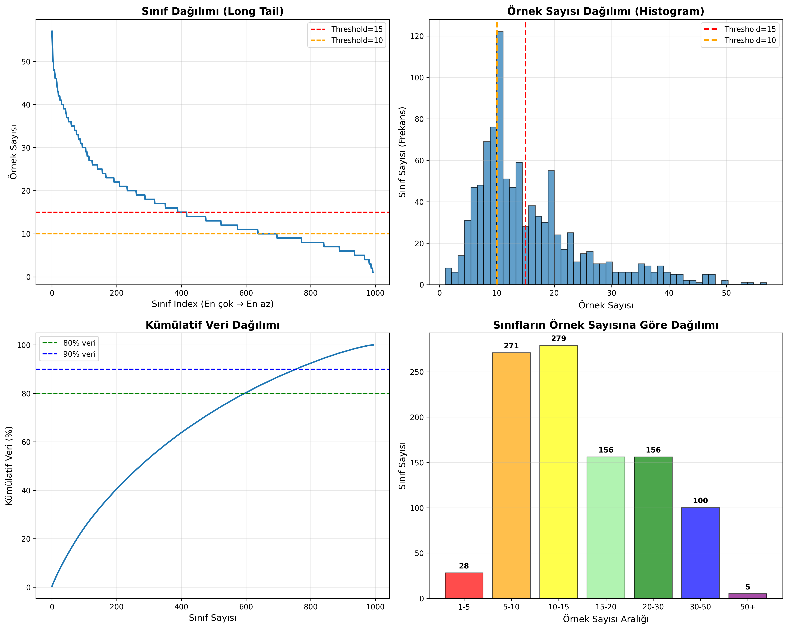
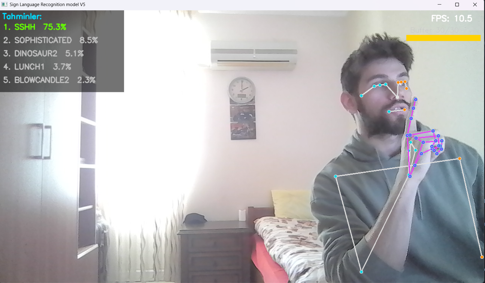

# Technical Report: Real-Time ASL Sign Language Recognition System

**Date:** March 2026

**Final Dataset:** ASL Citizen (Microsoft Research, 2023)

**Project:** Real-time sign language recognition with 2731 classes, signer-independent

---

## Table of Contents

1. [Introduction and Motivation](#1-introduction-and-motivation)
2. [Project Development Process](#2-project-development-process)
3. [Phase 1 — Alphabet Recognition Prototype](#3-phase-1--alphabet-recognition-prototype-experimentsletter_recognition)
4. [Phase 2 — MS-ASL Initiative](#4-phase-2--ms-asl-initiative-archive)
5. [Phase 3 — Full System with ASL Citizen](#5-phase-3--full-system-with-asl-citizen)
6. [Feature Extraction Pipeline](#6-feature-extraction-pipeline)
7. [Data Augmentation](#7-data-augmentation)
8. [Model Architectures](#8-model-architectures)
9. [Top-100 Prototyping Experiments](#9-top-100-prototyping-experiments)
10. [Full Dataset Training Versions — V1 to V5](#10-full-dataset-training--v1-to-v5)
11. [Real-Time Inference](#11-real-time-inference)
12. [Results and Analysis](#12-results-and-analysis)
13. [Limitations and Future Work](#13-limitations-and-future-work)
14. [Conclusion](#14-conclusion)

---

## 1. Introduction and Motivation

Sign language recognition is a field at the intersection of computer vision, machine learning, deep learning, and natural language processing, aimed at facilitating communication for deaf and hard-of-hearing individuals. The majority of existing systems operate with limited vocabulary or under controlled conditions.

This project simultaneously addresses four core challenges:

- **Scale:** 2731 distinct ASL signs — the minimum required to reach a practical vocabulary
- **Data scarcity:** An average of only 14.7 training examples per class
- **Generalization:** Signer-independent setting — operating on unseen individuals at inference time
- **Real-time performance:** Low latency over a standard webcam

Instead of video-based CNN approaches, a lighter, faster, and position-independent **skeleton landmark**-based pipeline was chosen.

---

## 2. Project Development Process

The project evolved through three progressively larger phases. Each phase was built to address the limitations or shortcomings of the previous one. Each phase contains considerably more experimentation and observation than the one before.

```
├─ Phase 1: Alphabet prototype (experiments/letter_recognition)
│   → YOLO + CNN was tried first. Due to instability and generalization issues, switched to MediaPipe + NN.
│   Single hand, static poses, 26 letters, Dense NN
│   → Works but only for static signs. Dynamic signs not supported.
│
├─ Phase 2: MS-ASL initiative (archive)
│   Video downloading from YouTube (yt-dlp), SVM + LSTM experiments
│   → 30-40% of videos have been removed or set to private on YouTube.
│   → After threshold filtering, only 217 classes remain, each with 15–50 examples.
│
└─ Phase 3: ASL Citizen (main system)
    Microsoft's pre-downloaded dataset, 83,399 videos
    → Full pipeline: extraction → augmentation → CNN+BiLSTM+Attention
    → Real-time inference + sentence construction
│
└─ Top-100 prototype → V1 → V2 → V3 → V4 → V5 (best model)
```

---

## 3. Phase 1 — Alphabet Recognition Prototype (`experiments/letter_recognition/`)

### 3.1 Motivation and Scope
YOLO + CNN was tried first. Due to instability and generalization issues, switched to MediaPipe + NN.

As a first step, a simple real-time recognition system was built for the ASL hand alphabet (A–Z, 26 letters). The goal was to learn how MediaPipe works and build an end-to-end pipeline.

### 3.2 Data Collection (`collect_data.py`)

A custom data collection script was written. Single hand landmarks (21 landmarks × 3 coordinates = 63 features) were captured from webcam using MediaPipe Hands, and each frame was written as a row to `dataset/asl_landmarks.csv`.

```
User: enters letter label → stops with Q → appended to CSV
```
Distribution of my asl_alphabet.csv dataset ⇒
- shape → (24352, 64)
- R ~ 1145
- X ~ 1092
- U ~ 1089
- W ~ 1077
- D ~ 1001
- A ~ 1000
- M ~ 1000
- Q ~ 1000
- P ~  1000
- O ~ 1000
- N ~ 1000
- L ~ 1000
- K ~ 1000
- I ~ 1000
- H ~ 1000
- G ~ 1000
- F ~ 1000
- E ~ 1000
- B ~ 999
- S ~ 999
- C ~ 999
- Y ~ 997
- V ~ 990
- T ~ 964

### 3.3 Model and Training (`train_model.py`)

**Model:** Pure Dense NN
```
Input (63,) → Dense(256, relu) → Dropout(0.4)
           → Dense(512, relu) → Dropout(0.4)
           → Dense(26, softmax)
```
Labels: one-hot (`to_categorical`), loss: `categorical_crossentropy`

- The MLP model trained on collected MediaPipe landmark data achieved 96% accuracy.
- Letters J and Z were excluded since they are performed as motion gestures during data collection.

### 3.4 Real-Time Prediction (`predict_live.py`)

For each frame: landmark extraction → model prediction → letter displayed on screen.

### 3.5 Limitations and Lessons Learned from Phase 1

| Limitation                               | Solution in next phase                     |
|------------------------------------------|--------------------------------------------|
| Static poses only                        | Time-series models (LSTM)                  |
| Single hand                              | Pose + both hands (MediaPipe Holistic)     |
| 26 classes                               | 2731 classes                               |
| —                                        | Body-relative normalization (torso scale)  |
| one-hot + categorical CE → large vectors | sparse CE → RAM savings                    |

- In the MediaPipe + NN experiment, a dataset was created for each letter using MediaPipe. This dataset was trained with an MLP neural network and various improvements were made. As a result, all letters except J and Z were detected with 96% accuracy even under varying environment, angle, and lighting conditions. This provided a great foundation and evaluation point for the project. However, it became clear that a real-time sign language translation system could not be built without LSTM or Transformer models, so the project was reshaped using the knowledge and results from these experiments.

---

## 4. Phase 2 — MS-ASL Initiative (`archive/`)

### 4.1 Why MS-ASL?

MS-ASL (Microsoft American Sign Language Dataset) is a large-scale dataset containing 1000 word classes and YouTube URLs. It was preferred due to its relatively easy accessibility.

### 4.2 Video Downloader (`archive/msasl-video-downloader/`)

MS-ASL videos are provided via YouTube links; they are not pre-downloaded. Therefore, a `yt-dlp`-based video downloader was developed:

- **`dataset_manager.py`:** Provides bulk downloading for train/val/test splits, clips video using `moviepy` based on `start_time`–`end_time` from JSON
- - Since dataset_manager.py caused too many issues, the yt-dlp tool was integrated.
- **Error handling:** 3 retries per video, skipping private/unavailable videos, 30-second pause every 50 videos for YouTube rate limiting
- **Dataset size selection:** MS-ASL100, 200, 500, 1000, or all data per split
- **`gloss_lookup.py`:** Tool for converting class IDs 0–999 to words

### 4.3 MS-ASL Preprocessing Scripts

**`clean_msasl_json.py`:** Matches downloaded videos with JSON records; removes videos that could not be downloaded or found from JSON.
- MSASL train clean.json → clean: 11883  missing: 4171
- MSASL val clean.json → clean: 2510  missing: 2777
- MSASL test clean.json → clean: 2422  missing: 1750

**`class_distribution_analysis.py`:** Analyzes the class distribution of the MS-ASL train set and produces a histogram. Analysis result: some classes had 50+ examples while others had only 2–3.
<p align="center">
  
</p>
<p align="center">
  <em>Class distribution after threshold >= 15 filter</em>
</p>

- A long-tail problem was identified with a total of 999 classes and 15654 video examples.

**`threshold_filter_remap.py`:** Filters classes with fewer than 15 examples in the train set using a threshold >= 15 filter, and renumbers the remaining classes starting from 0. This remapping is necessary because the original MS-ASL labels are not consecutive.
- The threshold of 15 was chosen because optimal model speed and accuracy was achieved at this value.
- threshold >= 15 → total classes: 284
- train → 6020
- val → 1156
- test → 912
- Landmarks were successfully extracted from a total of 8088 videos across train + val + test.

### 4.4 MS-ASL Era Model Experiments

Both classical machine learning and deep learning experiments were conducted during this period. However, due to incorrect normalization and scaling of landmark extractions at this stage, as well as the noisy and limited nature of the videos, the performance metrics were very insufficient. After this point, a decision was made to evolve the project with a new dataset and proper scaling of absolute landmark coordinates.

- **LSTM** (`archive/base_lstm_model.h5`, ~4.3 MB): LSTM training on MediaPipe landmark features
- **SVM** (`archive/svm_model.save`, ~6.8 MB): SVM classifier from single-frame landmark features
- Separate StandardScalers for both models: `archive/standardscaler.save`, `archive/svm_scaler.save`

### 4.5 Reasons for Abandoning MS-ASL

| Problem                                                                                                                                  | Impact |
|------------------------------------------------------------------------------------------------------------------------------------------|--------|
| 30–40% of videos removed/private on YouTube. <br/>After cleaning, only a small and noisy dataset remains. | Large portion of dataset is missing |
| Variable video trimming quality                                                                                                           | Some sign beginnings are cut off |
| Unpredictable video download time.                                                                                                        | Experiment loop is very slow |
| YouTube rate limiting                                                                                                                     | Bulk downloading unreliable |

ASL Citizen provides pre-downloaded videos where each video already covers a single sign (no trimming needed). The videos are also of higher quality and relatively less noisy. Due to these advantages, the dataset was switched to ASL Citizen.

---

## 5. Phase 3 — Full System with ASL Citizen

### 5.1 ASL Citizen Dataset

ASL Citizen, published by Microsoft Research in 2023, contains carefully collected sign language videos performed by members of the Deaf community for sign language research.

| Feature                        | Value                     |
|--------------------------------|---------------------------|
| Source                         | Microsoft Research (2023) |
| Total videos                   | 83,399                    |
| Number of classes (unique gloss) | 2,731                   |
| Number of signers              | 52                        |
| Average video duration         | ~2.3 seconds              |
| Video format                   | MP4, flat folder structure |
| Filename format                | `{id}-{GLOSS}.mp4`        |
| Metadata                       | `.csv`                    |

**Split statistics:**

| Split | Video count | Description                              |
|-------|-------------|------------------------------------------|
| Train | 40,154 | min=9, max=24, avg=14.7 per class        |
| Val   | 10,304 | At least 1 example in every class        |
| Test  | 32,941 | Completely different signers             |

<p align="center">
  
</p>
<p align="center">
  <em>Class distribution for the train dataset</em>
</p>

**Signer-independent split strategy:** Signers in the val and test sets are not present in the training set. This was intended to provide a generalized evaluation environment where the model cannot memorize a signer. However, the approximately 15 original examples per class (excluding augmentation) later showed that the model was memorizing signer styles along with the signs. (details below)

**CSV structure:**
```
Participant ID, Video file,     Gloss,      ASL-LEX Code
P1,             15890...APPLE.mp4, APPLE,   A_03_054
```

**Label mapping:** Unique glosses across all splits are collected, sorted alphabetically using `sorted()`, and assigned 0-based integer indices. Since this mapping is deterministic, consistency across extraction, training, and inference phases is guaranteed.

---

## 6. Feature Extraction Pipeline

### 6.1 MediaPipe Holistic

Each video frame is processed with MediaPipe Holistic (model_complexity=1). Holistic can simultaneously extract pose, face, and both hand landmarks.

This project uses **pose + left hand + right hand**. Face landmarks are excluded because facial expressions in some sign language videos are not sufficiently distinct or meaningful, and the feature count per frame would be as high as 1662, which would result in a slow real-time model.

**Feature dimensions:**

| Region    | Landmarks | Dims/LM      | Total               |
|-----------|-----------|--------------|---------------------|
| Pose      | 33        | 4 (x, y, z, vis) | 132             |
| Left hand | 21        | 3 (x, y, z)  | 63                  |
| Right hand| 21        | 3 (x, y, z)  | 63                  |
| **Total** | 75        | —            | **258 (feature dim)** |

### 6.2 Body-Relative Normalization

The same sign recorded in two different videos produces different raw coordinates due to the person's distance and position from the camera. To eliminate this, hierarchical normalization is applied:
- body-relative
- shoulder-mid
- hips-mid
- torso-scale
- wrist-relative

**Reference point and scale:**

```
left shoulder  = pose landmark 11 [:3]
right shoulder = pose landmark 12 [:3]
shoulder_mid   = (left_shoulder + right_shoulder) / 2

left hip  = pose landmark 23 [:3]
right hip = pose landmark 24 [:3]
hip_mid   = (left_hip + right_hip) / 2

torso_scale = ||shoulder_mid[:2] − hip_mid[:2]||   (2D Euclidean distance)
if torso_scale < 1e-6: torso_scale = 1.0            (zero-division guard)
```

**Pose normalization** (visibility unchanged, only x,y,z):
```
pose[i, :3] = (pose[i, :3] − shoulder_mid) / torso_scale
```

**Hand normalization** (2 steps):
```
# Step 1: Finger coordinates made wrist-relative (preserves hand shape)
wrist = hand[0, :3]
hand[i, :3] = (hand[i, :3] − wrist) / torso_scale

# Step 2: The wrist itself is written body-relative (hand position on body)
hand[0, :3] = (wrist − shoulder_mid) / torso_scale
```

This approach encodes both the hand shape and its position on the body.

### 6.3 Temporal Normalization

ASL Citizen videos typically vary between 24–60 FPS and have different lengths. All videos are normalized to 30 frames (target frame) using linear interpolation.

```python
idxs = np.linspace(0, len(frames) - 1, 30).astype(int)
resized = [frames[i] for i in idxs]
```

30 frames corresponds to approximately 13 FPS for a ~2.3-second video; this resolution is sufficient to capture sign movements.

### 6.4 Zero Padding

If pose or hand is not detected in a frame, the relevant region is filled with a zero vector via np.zeros(30, 258). These zero frames are preserved after scaling for Masking compatibility (skipped by the model during training).

### 6.5 Output Format

For each video, a `float32` numpy array of shape `(30, 258)` is saved as a `.npy` file. Total disk usage (all splits, raw `.npy`): ~2–4 GB.
- train → 40154 .npy files (63 hours)
- val → 10304 .npy files (18 hours)
- test → 32941 .npy files (51 hours)

A total of 132 hours of landmark extraction was completed successfully and without loss.

---

## 7. Data Augmentation

### 7.1 Motivation

~15 training examples per class is extremely limited for 2731 classes. Deep learning models easily overfit under these conditions. Augmentation expands the training set 6-fold.

### 7.2 Cache System

Augmentation is applied deterministically and the result is saved as `features/cache_train_aug.npz` (~750 MB). Subsequent training runs load directly from cache.

The reason for this design decision is that cached .npy data loads much faster, making it very suitable for model and version experimentation. Stochastic augmentation (different data each epoch) can improve generalization but eliminates the speed advantage provided by caching.

### 7.3 Augmentation Details

**Landmark Augmentation (4× copies):**

*1. Gaussian Noise:*
```python
noise = np.random.normal(0, σ=0.005, size=seq.shape) # zero frames are recorded for masking protection
seq = seq + noise
seq[zero_mask] = 0.0  # restores zero frames
```

*2. Temporal Shift:*
```python
shift = np.random.randint(-1, 2)  # shifts between -1 and +1 frames
# shift > 0: pad start, crop end
# shift < 0: pad end, crop start
```

*3. Speed Change (50% probability):*
```python
speed_factor = np.random.uniform(0.9, 1.1)
new_len = int(30 * speed_factor)
# extended or shortened to new_len via linear interpolation
# then resampled to 30 frames
```

**Mirror Augmentation (1× copy):**

Some ASL signs vary by hand preference (dominant hand). Mirroring adds diversity to cover left-handed and right-handed variations. The mirror augmentation component could be further improved.

```
Pose: all x coordinates × (−1)
Pose: 16 left-right landmark pairs swapped (shoulder <-> shoulder, elbow <-> elbow, ...)
Hand blocks: features[132:195] <-> features[195:258]  (left <-> right)
Hand x coordinates: × (−1)
```
- Only x-axis mirroring + left-right landmarks are mirrored.

### 7.4 Post-Augmentation Data Size

| Split | Raw examples | Augmented    | Size (approx.) |
|-------|-------------|--------------|----------------|
| Train | 40,154      | 240,924 (×6) | ~750 MB (cache) |
| Val   | 10,304      | 10,304       | ~30 MB          |
| Test  | 32,941      | 32,941       | ~100 MB         |

- All .npy files on disk were converted to `X (batch_size, timestep, feature_dim)` and `y (batch_size,)` format.
- Additionally, selected_classes was added to perform model experiments and measure performance on small subsets before full training. (e.g., top-100 classes)

---

## 8. Model Architectures

Four different architectures were developed. All models were saved in .h5 format. Common features of all models:
- Input shape: `(30, 258)`
- Loss: `sparse_categorical_crossentropy` (integer labels)
- Optimizer: Adam

### 8.1 LSTM (`base_lstm_model`)

```
Input (30, 258)
→ Masking(0.0)
→ LSTM(128, return_sequences=True)
→ LSTM(128, return_sequences=False)
→ Dense(256, relu) → Dropout(0.5)
→ Dense(num_classes, softmax)
```

A two-layer stacked LSTM model was used. The first layer preserves all timestep outputs while the second layer produces a summary vector. Used as the simplest architecture and treated as a reference point.

### 8.2 BiLSTM (`bidirectional_lstm_model`)

```
Input (30, 258)
→ Masking(0.0)
→ BiLSTM(128, return_sequences=True)   → (30, 256)
→ BiLSTM(128, return_sequences=False)  → (512,)
→ Dense(256, relu) → Dropout(0.5)
→ Dense(num_classes, softmax)
```

Each BiLSTM layer is bidirectional (forward + backward). The second layer concatenates the last hidden states (forward + backward). Large model due to parameter count (~11M). However, no notable improvement over base_lstm_model relative to parameter count was observed.

### 8.3 CNN + BiLSTM (`bidirectional_lstm_cnn_model`)

```
Input (30, 258)
→ Conv1D(64, k=3, padding=same, L2(0.002)) + BatchNorm + ReLU
→ Conv1D(64, k=3, padding=same, L2(0.002)) + BatchNorm + ReLU
→ BiLSTM(64, return_sequences=False)
→ Dense(128, relu) → Dropout(0.5)
→ Dense(num_classes, softmax)
```

The Masking layer was removed in this model. Conv1D does not propagate the Masking mask to subsequent layers; due to this Keras limitation, zero frames cannot be filtered. Zero frames are handled separately in train.py. (details in the train.py section)

### 8.4 CNN + BiLSTM + Attention (`cnn_bilstm_attention_model`) — Active Model

```
Input (30, 258)
→ Conv1D(64, k=3, same, L2=0.001) + BN + ReLU     (local feature extraction)
→ Conv1D(64, k=3, same, L2=0.001) + BN + ReLU
→ BiLSTM(128, activation='tanh', return_sequences=True, recurrent_dropout=0.0)      (global context, (30, 256))
→ Dropout(0.3)
→ MultiHeadAttention(heads=4, key_dim=64)          (self-attention)
→ LayerNorm(x + attention)                         (residual connection)
→ tf.reduce_mean(axis=1)                           (256,)
→ Dense(256, relu, L2=0.001) → Dropout(0.5)
→ Dense(num_classes, softmax)
```

**Architectural decisions:**

| Component                    | Reason                                                                                          |
|------------------------------|-------------------------------------------------------------------------------------------------|
| Conv1D × 2                   | Local temporal patterns (finger curls, wrist rotations); feature transformation before BiLSTM  |
| BiLSTM                       | Bidirectional context; better understanding by looking at both the end and beginning of a sign  |
| self-attention               | Determining which frames are more important and weighting peak motion moments                    |
| Residual conn. + LayerNorm   | Gradient stability; safe learning process with attention bypass                                 |
| reduce_mean                  | Parameter-free pooling; more stable than learnable pooling with limited data                    |

- **The `Attention` mechanism led to a major improvement. The reason is that in sign language, attention can identify the important frames specific to each sign. Additionally, `L2(0.001)` was marginally successful in dealing with overfitting.**
- `recurrent_dropout=0.0` → This is a dropout type applied between hidden states across timesteps in RNN models. It reduces overfitting but **disables NVIDIA's cuDNN, causing GPU to run much slower.** Therefore it was disabled at 0.0 and a 0.3 dropout was applied immediately after the BiLSTM layer.!

---

## 9. Top-100 Prototyping Experiments

### 9.1 Why Prototype?

Full training with 2731 classes required hours per experiment. First, a quick architecture comparison was done with the first 100 classes in alphabetical order. The best model was identified from this comparison, and then the best variation of that model for the full dataset (2731 classes) was determined.

### 9.2 Top-100 Results

Four architectures were compared on top-100 with the same hyperparameters:

| Model | File | Size | Parameters | Train Acc | Val Acc | Test Acc | Best Epoch |
|-------|-------|------|------------|-----------|---------|----------|------------|
| base_lstm | `base_lstm_model_top100.h5` | 4.5 MB | — | 98.1% | 56.4% | 58.5% | 21 |
| bidirectional_lstm | `bidirectional_lstm_model_top100.h5` | 11 MB | — | — | — | — | — |
| cnn_bilstm | `bidirectional_lstm_cnn_model_top100.h5` | 1.9 MB | 158k | 99.4% | 77.4% | 65.3% | 23 |
| **cnn_bilstm_attention** | `cnn_bilstm_attention_model_top100.h5` | 2.7 MB | **224k** (+66k Attention) | 99.8% | **78.9%** | **75.4%** | 36 |
| Top-100 StandardScaler | `standardscaler_top100.save` | — | — | — | — | — | — |

> For the full dataset (2731 classes), `cnn_bilstm_attention` parameter count reaches ~15M including the output layer.

`cnn_bilstm_attention_model` achieved both the highest accuracy and the smallest model size (no need for large Dense layers with attention pooling). This result confirmed the decision to use this architecture for the full dataset.

### 9.3 Transition from Top-100 to Full Dataset

- `selected_classes = None` (landmarks_extract.py and train.py)
- Number of labels: 100 → 2731
- Model output layer: `Dense(100)` → `Dense(2731)` (num_classes)

---

## 10. Full Dataset Training — V1 to V5

### 10.1 Preprocessing

**StandardScaler:** All training data is unfolded into `(N × 30, 258)` format, and the scaler is fitted on this 2D representation. Val and test are transformed using the same scaler. The scaler is saved as `models/standardscaler.save` and reloaded during inference.

**Zero frame protection:** In frames where MediaPipe cannot detect hand or pose, the relevant regions are filled with zero vectors via np.zeros. StandardScaler corrupts these zeros with the formula `(0 − μ) / σ`, making the Masking layer unable to recognize these frames. The solution was implemented in train.py by recording the originally zero frames before StandardScaler is applied, then restoring them to zero after scaling.

```python
zero_mask = (X_2d == 0.0).all(axis=1)   # rows where all 258 dimensions are zero
X_scaled   = scaler.fit_transform(X_2d)
X_scaled[zero_mask] = 0.0               # restore zero frames
```

**Class weight:** `compute_class_weight('balanced')` was used to address class imbalance. Since some classes in 2731 had only 9 examples while others had 24, this step provided a critical improvement for the model.

**Memory management:** RAM reached ~20 GB during the scaling operation, causing an OOM error. Temporary 2D arrays were deleted after scaling, freeing ~8.5 GB of RAM. (may vary depending on hardware!)
```python
del X_train_2d, X_train_2d_scaled
del X_val_2d, X_val_2d_scaled
del X_test_2d, X_test_2d_scaled
```

### 10.2 Hyperparameter Search

| Ver | LR Schedule | LR | RLRP patience | factor | Dropout | L2 | Label Smooth | Val Acc | Test Acc | Best Epoch |
|-----|-------------|-----|---------------|--------|---------|-----|--------------|---------|----------|------------|
| V1 | RLRP | 3e-4 | 5 | 0.5 | 0.3 | 0.001 | No | 66.4% | 57.3% | 28 |
| V2 | CosineDecay | 1e-3 | — | — | 0.4 | 0.002 | Yes | ~60.0% | 49.83% | ~22 |
| V3 | CosineDecay | 1e-3 | — | — | 0.4 | 0.001 | Yes | 62.3% | 53.2% | 23 |
| V4 | CosineDecay | 3e-4 | — | — | 0.3 | 0.001 | No | 65.97% | 56.31% | 21 |
| **V5** | **RLRP** | **3e-4** | **10** | **0.3** | **0.3** | **0.001** | **No** | **68.44%** | **60.37%** | **53** |

RLRP: ReduceLROnPlateau

<p align="center">
  
</p>

### 10.3 Version Analysis

**V1 → baseline configuration**

Configuration started with ReduceLROnPlateau. With RLRP patience=5, the model reached its highest val accuracy at epoch 28 and early stopping was triggered. This early stopping was later understood to be the root cause of the problem.

**V2, V3 — CosineDecay + Label Smoothing**

CosineDecay reduces the learning rate according to a fixed schedule. It performed worse than reactive RLRP for this problem: LR remained large at plateaus, preventing efficient learning. Additionally, label smoothing weakened the correct signal in low-sample classes. Increasing the dropout level to 0.4 also significantly hurt the model. The dropout level was reverted to 0.3 as in V1.

**V4 — CosineDecay, no label smoothing**

Label smoothing was removed and LR was lowered from 1e-3 to 3e-4. The result was close to V1 but lacked the reactivity of RLRP. This yielded no good results. The decision was made to return to RLRP and update the L2 value to 0.001.

**V5 — critical change, best active model**

<p align="center">
  
</p>

`patience=5 → 10` and `factor=0.5 → 0.3`. The best model was obtained with these two changes.
- **Patience 10:** The model reduces LR when there is no improvement for 10 epochs. In V1, this was triggered after 5 epochs, causing the LR to drop too much and leading to early freezing.
- **Factor 0.3:** LR is reduced more aggressively. This provided a sharper learning rate cut when stuck at a plateau.

**Result:** The model was able to learn up to epoch 53 in V5 (it had frozen at epoch 28 in V1). Val accuracy 66.4% → 68.44%, test accuracy 57.3% → 60.37%.

### 10.4 Val–Test Gap Analysis

The val–test gap remained approximately constant across all versions (~9 points):

```
V1: 66.4% − 57.3% = 9.1
V2: 60.0% - 49.83% = 10.1
V3: 62.3% − 53.2% = 9.1
V4: 65.97% − 56.31% = 9.7
V5: 68.44% − 60.37% = 8.1
```

**Source of the gap:** While the val set contains the same signers as train, the test set contains completely different signers. With ~15 examples and ~3 signers per class, the model learns individual movement styles rather than sign language (signer memorization). This is a structural data problem and cannot be closed with hyperparameters. The fact that `val-test gap = ~8.1` and `~9.1` points across all versions shows that the model does not have a hyperparameter problem — the real issue lies in the data.
- To partially address this issue, mixed augmentation could be applied, but it was observed that excessive augmentation suppresses the original data and reaches a new plateau after +3-5 points. It is certainly possible, but since increasing parameters and costs was not desired, the current best model V5 was taken as the base.
- 2731 classes → `random guess: 0.037%`
- `V5 test accuracy: 60.37%` → `~1600×` better than random

---

## 11. Real-Time Inference

### 11.1 Pipeline

```
Webcam frame
  │
  ├─ BGR → RGB conversion
  ├─ MediaPipe Holistic processing
  │   (min_detection_confidence=0.5, min_tracking_confidence=0.5) # these values can be changed
  ├─ extract_landmarks_frame()
  │   (same normalization as landmarks_extract.py)
  └─ add to deque(maxlen=30) sliding window
         │
         ▼ (when buffer is full, every 3 frames)
  ├─ compute zero_mask
  ├─ scaler.transform(flat)
  ├─ flat[zero_mask] = 0.0
  ├─ model.predict(x[np.newaxis])  → (2731,)
  ├─ top-5 predictions
  └─ update pred_history
         │
         ▼ (stability check)
  ├─ Check last 5 predictions for same word
  ├─ All confidences ≥ 0.60
  ├─ Lock duration passed or different word check
  └─ Yes → add to sentence
```

### 11.2 Normalization Consistency

During inference, the `extract_landmarks_frame()` function is identical to `landmarks_extract.py`. This is a critical point because inference must process data in exactly the same way as the training data was processed. Different normalization renders the trained model meaningless. If the normalization part changes, landmarks must be re-extracted according to the new normalization method using the landmark_extract.py file.

### 11.3 Sentence Construction Parameters

| Parameter | Value | Description |
|-----------|-------|-------------|
| `STABILITY_COUNT` | 5 | How many consecutive same predictions are required |
| `CONFIDENCE_THR` | 0.60 | Minimum softmax confidence |
| `LOCK_DURATION` | 1.5 sec | Prevents the same word from being added again |

These parameters balance two types of errors:
- **False positive:** Adding a temporary wrong prediction to the sentence (increase STABILITY_COUNT)
- **False negative:** Not adding a real sign to the sentence (decrease STABILITY_COUNT or CONFIDENCE_THR)

### 11.4 Performance

- predict() call per frame: ~5 FPS (unstable)
- predict() every 3 frames: ~15–20 FPS (usable)
- Webcam resolution: 1280×720

### 11.5 System Screenshots

<p align="center">
  
</p>
<p align="center">
  <em>DENTIST sign — top-5 predictions and buffer fill indicator</em>
</p>

<p align="center">
  
</p>
<p align="center">
  <em>Sentence construction: GREET → MY → HAIRDRYER → FINE</em>
</p>
<p align="center">
    <em>A structure was added to inference.py that can hold words and construct sentences sequentially, even if slowly. This makes it possible to form words one by one. However, due to the signer dependency problem, the model may associate performed hand movements with other signs made by signers in the dataset. For more consistent sentences, signs from the dataset can be used as reference.</em>
</p>

<p align="center">
  
</p>
<p align="center">
  <em>SSHH sign — stable prediction with 75% confidence score</em>
</p>

---

## 12. Results and Analysis

### 12.1 Final Results (V5)

| Metric | Value |
|--------|-------|
| Val accuracy | **68.44%** |
| Test accuracy | **60.37%** |
| Number of classes | 2,731 |
| Examples per class (average) | 14.7 |
| Random baseline | 0.037% (1/2731) |
| Test acc / Random | ~1,631× |
| Best epoch | 53 |

### 12.2 Model Sizes

| Model | Size |
|-------|------|
| `cnn_bilstm_attention_model_v5.h5` | 15 MB |
| `standardscaler.save` | 6.7 KB |

### 12.3 Architecture Comparison (Top-100)

| Model | Parameters (~) | Size |
|-------|----------------|------|
| base_lstm | ~4.5M | 4.5 MB |
| bidirectional_lstm | ~11M | 11 MB |
| cnn_bilstm | ~1.9M | 1.9 MB |
| cnn_bilstm_attention | ~15M (2731 classes) | 15 MB |

### 12.4 Project Process Evaluation

**Successes:**
- 3 different datasets / approaches were tried; each phase built on the lessons of the previous one
- Normalization, augmentation, cache, zero-mask → each pipeline step was designed by improving the previous version
- Systematic hyperparameter search (V1 → V5); errors and critical points were correctly analyzed (patience and factor)
- Real-time system completed, sentence construction integrated

**Limitations:**
- No stochastic augmentation (cache trade-off)
- *No comparison was made with video-based models such as I3D or Video Swin. These models learn directly from pixel-level video frames. This means they would be heavily influenced by the signer's clothing, background, angle, etc. Unlike landmark extraction which abstracts environmental factors, these models cannot abstract environmental factors, which can lead to excessive overfitting. Additionally, 15 original examples per class is far too few to fine-tune models like I3D or Video Swin. Therefore, the landmark extraction approach was preferred as it is lighter and much smoother for real-time operation.*

---

## 13. Limitations and Future Work

### 13.1 Current Limitations

**Signer memorization:** The combination of ~15 examples and ~3 signers per class causes the model to learn signer styles. The val–test gap is a direct indicator of this.

**Static augmentation:** The cache system fixes augmentation. Seeing different augmented data each epoch could slightly alleviate overfitting, but eliminates the speed advantage provided by caching.

**Missing hand size normalization:** Finger coordinates are made wrist-relative but are not scaled according to hand size. Transfer between signers with different hand sizes remains limited.

**Lighting and background:** MediaPipe Holistic is sensitive to background and lighting conditions, despite efforts to suppress this. This negatively affected inference quality.

### 13.2 Future Work

| Improvement | Expected Impact | Description |
|-------------|-----------------|-------------|
| Mixup augmentation | +2–4% test acc | Linear interpolation between classes; can alleviate signer memorization |
| Hand size normalization | +3–6% test acc | Finger coordinates can be scaled according to hand size. <br/>Requires ~132 hours of re-extraction! |
| Stochastic augmentation | +1–1.5% | Cache removed, different augmentation each epoch may slightly reduce overfitting |
| I3D / Video Swin comparison | Reference | Raw pixel-based approach; comparison with landmark approach <br/>(may perform worse with this project's dataset) |
| Language model integration | Sentence accuracy | Context can be added to sign predictions and probable ASL word sequences can be filtered |
| TFLite + MediaPipe Mobile | Mobile deployment | Model compression can be tried as a separate project <br/>(requires pruning/quantization) |

---

## 14. Conclusion

This project is the product of a three-phase development process. Starting from hand alphabet recognition, challenges with YouTube-based data collection through MS-ASL were encountered; ultimately, a full-scale, signer-independent system was built using the Microsoft ASL Citizen dataset.

### Core contributions:

- Body-relative 2-stage normalization (position and scale independence)
- 6× deterministic augmentation + cache system
- Zero frame protection (StandardScaler + Masking compatibility)
- CNN + BiLSTM + Multi-Head Attention architecture
- Systematic 5-version hyperparameter search
- Stability-based real-time sentence construction

### Final result:

**60.37% test accuracy was achieved under conditions of 2731 classes, signer-independent, ~15 examples per class. Compared to the random baseline, ~1631× improvement was achieved. The val–test gap (~8 points) reflects a structural data problem, and the current results were found to be competitive with similar challenging settings in the literature and sufficient for real-time demo purposes.**

---

Thank you for reading this report to the end. Feel free to share your thoughts and suggestions about the project.

**Contact:**

[](https://github.com/BoraErenErdem)
[](https://www.linkedin.com/in/bora-eren-erdem-9b132b339/)
